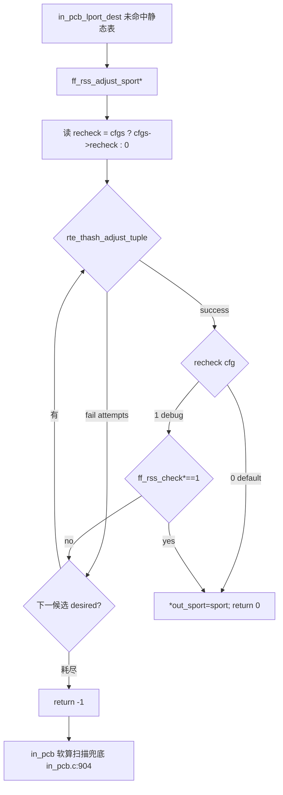

# 04 架构与方案设计 —— ff_rss_check 三项优化

> 原则：方案落点以实际代码/头文件为准，关键处给 `文件:行号`；不确定项标「待确认」并给倾向方案。
> 门控：所有内核侧改动一律 `#ifdef FSTACK` 包裹，关闭 FSTACK 退回原生 FreeBSD 行为；用户态新增能力对 IPv4 快路径**零回归**。
> 依赖事实：01 需求、02 现状（13.0↔15.0 diff、用户态 RSS、IPv6 缺口、rte_thash）、03 外网调研。

---

## 0. 总体架构与数据流

### 0.1 RSS 选端口总数据流（connect 主动连接）

```
应用 connect()
  └─ 内核 in_pcbconnect (in_pcb.c:1083)
       ├─ in_nullhost(inp_laddr)? → 选本地址 laddr
       │     原生: in_pcbladdr (L1129)
       │     【0.1 回迁】FSTACK: 先 ff_in_pcbladdr(AF_INET, faddr, fport, &laddr) 选与 RSS 对齐的本地址
       └─ anonport(无本地端口)? → in_pcb_lport_dest(... lookupflags)  (L1145)
             原生: 仅传 INPLOOKUP_WILDCARD
             【0.1 回迁】FSTACK: 传 INPLOOKUP_WILDCARD | INPLOOKUP_LPORT_RSS_CHECK
                 └─ in_pcb_lport_dest (in_pcb.c:756)
                      ├─ 解析并清除 INPLOOKUP_LPORT_RSS_CHECK
                      ├─ 命中静态表: ff_rss_tbl_get_portrange() → 从落本队列端口集轮转选端口 (快路径)
                      └─ 未命中静态表: 逐端口 + ff_rss_check() 软算校验落本队列
                            【0.3 优化】动态路径改用 rte_thash_adjust_tuple 反算端口
```

三层关系（与既有三层架构一致）：
- **用户态 lib**（`ff_dpdk_if.c`）：RSS hash 软算（`ff_rss_check`）、静态表（`ff_rss_tbl_*`）、本地址回调桥（`ff_in_pcbladdr`）、【0.3 新增】thash ctx。
- **内核钩子**（`in_pcb.c` / `in6_pcb.c`）：选端口时调用用户态接口，`#ifdef FSTACK` 门控。
- **配置**（`ff_config.c` / config.ini）：`rss_check` 段、【0.2 新增】v6 规则格式、`symmetric_rss` 开关（已存在）。

### 0.2 三项的依赖关系
- 0.1 是 0.3 的前置（0.3 的动态路径挂在 0.1 回迁后的 `in_pcb_lport_dest` 未命中分支里）。
- 0.2（IPv6）独立于 0.1/0.3 的 IPv4 路径，但其用户态 hash/表结构扩展会被 0.3 复用（IPv6 动态路径也走 thash）。
- 建议实施顺序：0.1 → 0.3（IPv4 动态优化）→ 0.2（IPv6 全链路，复用 0.1/0.3 框架）。详见 06。

---

## 1. 需求 0.1 方案：内核侧 RSS 选端口回迁至 15.0

### 1.1 落点与改动清单（以 15.0 实际代码为准）

| 改动点 | 文件:行号 | 13.0 参照 | 改动内容 |
|--------|-----------|-----------|----------|
| (A) 选端口逻辑 | `in_pcb.c` `in_pcb_lport_dest`(L756) body | 13.0 L689 body（L703-915） | 回迁 rss_* 局部变量、flag 解析/清除、portrange 获取、命中轮转/未命中软算 |
| (B) 本地址对接 | `in_pcb.c` `in_pcbconnect`(L1128 分支) | 13.0 `in_pcbconnect_setup` L1526-1530 | `in_nullhost` 分支内、`in_pcbladdr` 之前插入 `ff_in_pcbladdr(AF_INET,...)` |
| (C) flag 传入 | `in_pcb.c` `in_pcbconnect`(L1145-1147) | 13.0 L1583-1589 | lookupflags 增 `INPLOOKUP_LPORT_RSS_CHECK` |
| (D) 宏处理 | `in_pcb.h:623-625` | 13.0 同义 | 维持 `#define 0x80000000`（enum 外），见 §1.3 |

### 1.2 (A) `in_pcb_lport_dest` 回迁细节（适配 15.0）

13.0 完整逻辑（02 §2.1 取证）回迁，但须按 15.0 适配：

1. **局部变量声明**（对应 13.0 L703-709）：`u_short rss_first, rss_last, *rss_portrange;`、`static int rss_tbl_init=0;`、`int rss_check_flag`、`int rss_ret, rss_match=0;`、`struct ifaddr *ifa; struct ifnet *ifp;`，全部 `#ifdef FSTACK`。
2. **flag 解析 + 清除**（对应 13.0 L707/L712）：
   `rss_check_flag = lookupflags & INPLOOKUP_LPORT_RSS_CHECK;`
   `lookupflags &= ~INPLOOKUP_LPORT_RSS_CHECK;`
   注意 15.0 `inp` 为 `const struct inpcb *`（L756）——`lookupflags` 是值参（int），可直接改；不得改 `inp` 指向内容。
3. **portrange 获取**（对应 13.0 L794-830）：首次 `ff_rss_tbl_set_portrange(first,last)`；命中 `ff_rss_tbl_get_portrange(faddr.s_addr, laddr.s_addr, fport, &rss_first, &rss_last, &rss_portrange)` 置 `rss_match=1`；未命中用 `ifa_ifwithnet` 求 `ifp`（供软算用 `ifp->if_softc`）。
   - **15.0 适配**：13.0 用 `dorandom` 局部（L814/L834）；15.0 该函数用 `V_ipport_randomized`（L830）内联设置 `*lastport`。回迁时把 13.0 的 `dorandom` 改为 `V_ipport_randomized`，并保持「rss_match 时随机化作用于 `rss_portrange[0]` 索引」语义（13.0 L814-815）。
4. **选端口主循环**（对应 13.0 L842-915）：
   - 命中（`rss_check_flag && rss_match`）：从 `rss_portrange[]` 轮转取 `*lastport`（13.0 L846-851），端口集已保证落本队列，**跳过 lookup 的 RSS 复算**。
   - 未命中（`!rss_check_flag || !rss_match`）：原生 `++*lastport`（13.0 L853-860 = 15.0 L838-840）。
   - 未命中时动态校验（13.0 L896-911）：`in_pcblookup_local` 找到空位后，LOOPBACK 直接 break（13.0 L902-903），否则 `ff_rss_check(ifp->if_softc, faddr.s_addr, laddr.s_addr, fport, lport)` 软算，落本队列 break，否则 `tmpinp++` 继续（13.0 L909）。**0.3 将替换此处软算扫描为 thash 反算（见 §3）**。
   - **15.0 适配（lookup 签名）**：13.0 `in_pcblookup_local(pcbinfo, laddr, lport, lookupflags, cred)`（L894）→ 15.0 改为 `in_pcblookup_local(pcbinfo, laddr, lport, RT_ALL_FIBS, lookupflags, cred)`（02 §2.0，15.0 L877-878）；`in_pcblookup_hash_locked` 末参 13.0 `NULL, M_NODOM`（L873）→ 15.0 `M_NODOM, RT_ALL_FIBS`（L848）。回迁代码须对齐 15.0 现有调用形态（直接复用 L843-880 现有 lookup 调用，仅在外层包 RSS 分支）。

### 1.3 (D) `INPLOOKUP_LPORT_RSS_CHECK` 是否纳入 `INPLOOKUP_MASK`
- 现状（02 §2.2）：`INPLOOKUP_LPORT_RSS_CHECK = 0x80000000` 在 enum 外（`in_pcb.h:623-625`），不在 `INPLOOKUP_MASK`（L627）。
- **设计决策（倾向）：保持 enum 外、不纳入 MASK，沿用 13.0 行为**——在 `in_pcb_lport_dest` 入口先取出该 flag、再从 `lookupflags` 清除（§1.2.2），使其不污染下游 `in_pcblookup_*`（这些 lookup 会与 MASK 比对）。理由：纳入 MASK 反而可能让下游 lookup 误解析此 bit；13.0 已验证「解析后立即清除」方案正确。
- 备选：纳入 enum 并扩 MASK——需同步审计所有 `lookupflags & INPLOOKUP_MASK` 使用点，改动面更大、风险更高，**不推荐**。

### 1.4 风险与回归
- 关闭 FSTACK：全部 `#ifdef FSTACK` 段不编译，退回原生（无回归）。
- `rss_check` enable=0 / 单队列：`ff_rss_check` 内 `nb_queues<=1` 直接返回 1（`ff_dpdk_if.c:2858`），`ff_rss_tbl_get_portrange` 返回 -1（cfg 未启用），`rss_match=0`，自动走原生路径。
- LOOPBACK（`127.0.0.1`）：13.0 已特判 break（不做 RSS），回迁保留，保证内核栈本地回环正常。

---

## 2. 需求 0.2 方案：IPv6 RSS hash 与选端口

### 2.1 用户态 hash 输入布局（IPv6）
- IPv4 现状：`saddr(4)+daddr(4)+sport(2)+dport(2)=12B`（`ff_dpdk_if.c:2865-2880`）。
- IPv6 目标布局：`saddr6(16)+daddr6(16)+sport(2)+dport(2)=36B`（满足 0.3 `tuple_len` 4 倍数：36/4=9）。
- 落队列判定式不变：`((hash & (reta_size-1)) % nb_queues) == queueid`。

### 2.2 接口与表结构 IPv6 化 —— 两方案权衡

**方案 A：新增 v6 专用函数 + v6 专用表（推荐）**
- 新增 `ff_rss_check6(softc, struct in6_addr *saddr6, *daddr6, sport, dport)`、`ff_rss_tbl6_*`、`struct ff_rss_tbl6_type`（16B 地址）。
- 优点：IPv4 结构 `struct ff_rss_tbl_type`（`ff_dpdk_if.c:165`）/`ff_rss_check`（L2851）**完全不动 → IPv4 快路径零回归**（满足 01 §2.4 / 验收）；v4/v6 各自 cache 行对齐，无填充浪费。
- 缺点：代码有一定重复（hash 拼装、表查找逻辑两份），可用静态 helper 收敛公共部分。

**方案 B：地址用 16B 联合体，v4/v6 共用一套结构/函数**
- `struct ff_rss_tbl_type` 的 `saddr/daddr` 由 `uint32_t` 改为 16B 联合体（`union { uint32_t v4; uint8_t v6[16]; }`），`ff_rss_check` 加 `family` 参数。
- 优点：单一代码路径，无重复。
- 缺点：
  1. **改 `ff_rss_check` 签名 → 破坏 0.1 内核回迁的现有调用**（13.0 调用形态 `ff_rss_check(softc, faddr.s_addr, laddr.s_addr, fport, lport)` 须改），增加耦合与回归面。
  2. 静态表每条目内存膨胀（地址 4B→16B；表 `dip_tbl[MAX_DADDR]` × `[MAX_SADDR_SPORT_ENTRIES]`），IPv4 场景白白多占内存、且 `__rte_cache_aligned` 布局变化可能影响 IPv4 缓存局部性 → **IPv4 快路径可能回归**。

- **设计决策：采用方案 A（v6 独立函数/表）**。核心理由 = 01 验收硬约束「IPv4 路径零回归 + 不改已存在的 IPv4 接口签名」。方案 B 的签名变更与内存膨胀直接抵触该约束。【待确认：v6 表容量宏（`FF_RSS_TBL6_MAX_*`）取值，倾向沿用 v4 同名宏值（`ff_config.h:62-76`）以复用上限假设，编码阶段按内存预算复核。】

### 2.3 内核侧 IPv6 选端口对接点
- 事实（02 §3.2）：13.0/15.0 `in6_pcb.c` 均无 RSS 对接（全新增）。
- 关键发现：15.0 `in_pcb_lport_dest`（L756）**本身已是 v4/v6 统一函数**——含 INET6 分支：`laddr6/faddr6`（L819-825）、`in6_pcblookup_hash_locked`（L853）、`in6_pcblookup_local`（L861）。
- **设计决策（倾向）：优先复用统一路径 `in_pcb_lport_dest`**——0.1 回迁的 RSS 选端口逻辑在该函数内对 INET6 分支也加 RSS 钩子（用 `laddr6/faddr6` 调 `ff_rss_check6` / `ff_rss_tbl6_get_portrange`），避免在 `in6_pcb.c` 另起一套。
- 但须确认 IPv6 connect 实际是否经此函数选端口：
  - 入口为 `in6_pcbconnect` 系列（`in6_pcb.c`），其选 anonport 时是否调 `in_pcb_lport_dest`（如同 IPv4 的 `in_pcbconnect` L1145）还是另有 `in6_pcb_lport`。
  - 【待确认：IPv6 connect 的选端口调用链与 `INPLOOKUP_LPORT_RSS_CHECK` 透传点，编码阶段 grep `in6_pcbconnect`/`in6_pcb_lport` 核实。倾向方案：若 `in6_pcbconnect` 复用 `in_pcb_lport_dest`，则只需在 `in6_pcbconnect` 的选端口调用处传 RSS flag + 在 `in_pcbconnect` 同样位置加 `ff_in_pcbladdr(AF_INET6_FREEBSD,...)`（`ff_in_pcbladdr` 已支持 v6，`ff_dpdk_if.c:2581-2584`）；若走独立路径，则在 `in6_pcb.c` 新建对应钩子（沿用本函数逻辑）。】

### 2.4 网卡 / DPDK RSS offload field（IPv6）
- 现状（已核实）：`default_rss_hf = RTE_ETH_RSS_PROTO_MASK`（`ff_dpdk_if.c:681-683`），`RTE_ETH_RSS_PROTO_MASK` **已包含 IPv6/TCP_IPV6 等全部协议 field**，再 `&= dev_info.flow_type_rss_offloads`（L705）按硬件能力收窄。
- **结论：默认 rss_hf 即已开启 IPv6 RSS**，0.2 通常**无需改 rss_hf 配置**；仅需确认目标网卡 `flow_type_rss_offloads` 含 `RTE_ETH_RSS_IPV6`/`RTE_ETH_RSS_NONFRAG_IPV6_TCP`（否则会被 L705 收窄掉，IPv6 RSS 落单队列）。
- 注意：`ff_dpdk_if.c:1001/1167` 的 rte_flow 规则硬编码 `RTE_ETH_RSS_NONFRAG_IPV4_TCP`（流分流场景），若该路径需支持 v6 须同步加 v6 type。【待确认：本项目是否涉及该 rte_flow 路径，编码阶段确认；倾向：本项目 RSS 选端口走 port_conf.rss_hf 主路径，rte_flow 路径暂不在 0.2 范围，标注即可。】

### 2.5 配置 v6 解析
- 现状（02 §5.1）：`rss_tbl_cfg_handler`（`ff_config.c:880-921`）用 `inet_pton(AF_INET, ...)` 解析 daddr/saddr（L913-914）。
- 0.2 改动：按文本含 `:` 判定 v6，`inet_pton(AF_INET6, ...)` 解析为 16B，存入 v6 规则结构（见 05 配置项变更）。IPv4 解析分支保持不变（零回归）。

### 2.6 风险
- IPv4 零回归：方案 A 不动 v4 结构/函数（已分析）。
- 内存：v6 表新增内存预算需评估（§2.2 待确认）。
- 内核统一路径复用须以实际调用链为准（§2.3 待确认）。

---

## 3. 需求 0.3 方案：rte_thash_adjust_tuple 优化动态路径

### 3.1 总体策略：静态表快路径不变，仅优化「未命中静态表的动态扫描」
- **保留**：`ff_rss_tbl`（`ff_dpdk_if.c:172`）静态表命中路径（§1.2 命中分支）完全不变（性能最优，01 §3.4 明确保留）。
- **替换对象**：`in_pcb_lport_dest` 未命中分支里「逐端口 `++*lastport` + `ff_rss_check` 软算」的 O(端口数) 扫描（13.0 L896-911），改为：用 `rte_thash_adjust_tuple` **反算**出落本队列的源端口，一步到位（或少数 attempts）。
- **兜底**：thash 反算失败（attempts 用尽 / 非对称 key 反算不收敛）时，回退到现有软算 `ff_rss_check` 扫描（保证正确性下限）。

### 3.2 thash ctx 生命周期与 helper
- 初始化期（`ff_rss_tbl_init` 附近或 port 配置后）一次性：
  - `ctx = rte_thash_init_ctx(name, rsskey_len, reta_sz_log2, rsskey, flags)`。
    - `reta_sz` 传**对数**（`rte_thash.h:288-291`）：`reta_sz_log2 = log2(rss_reta_size[port])`（`rss_reta_size` 见 `ff_dpdk_if.c:133`；reta_size 必为 2 的幂，log2 精确）。
    - `key` 传当前 `rsskey`（`ff_dpdk_if.c:121`，与网卡一致）。
  - `rte_thash_add_helper(ctx, "sport", helper_len, sport_offset_bits)`：
    - `offset` = 源端口字段在元组中的 bit 偏移（IPv4 元组 `saddr(4)+daddr(4)+sport(2)+dport(2)`，sport 在第 8 字节 → offset=64 bit；IPv6 元组 sport 在第 32 字节 → offset=256 bit）。
    - `len` ≥ `reta_sz_log2`（`rte_thash.h:340-341`），且应覆盖可调整的 sport bit 范围（sport 16 bit）。倾向 `len=16`（整个 sport 字段可调）。
  - **非线程安全**（`rte_thash.h:333`）：ctx/helper 仅在初始化期建好，运行期只读用 `adjust_tuple`（后者多线程安全，L433）。
- 每 port 一个 ctx（reta_size 可能不同），存入 per-port 数组。

### 3.3 【核心】queueid → desired_value 映射推导（落队列对齐）

这是 0.3 正确性的命门（03 §3.4 风险点 1）。须使 `adjust_tuple` 反算出的端口，经 `ff_rss_check` 复核**确实**满足 `((hash & (reta_size-1)) % nb_queues) == queueid`。

定义：
- `R = reta_size`（2 的幂），`reta_sz_log2 = log2(R)`。
- `Q = nb_queues`，`q = queueid`（目标本队列）。
- `adjust_tuple` 的 `desired_value` 对齐 hash 的**低 `reta_sz_log2` bit**，即令 `hash & (R-1) == desired_value`（`rte_thash.h:443-444` + helper len 覆盖 reta_sz）。
- 落队列判定要求：`(hash & (R-1)) % Q == q`，即 `desired_value % Q == q`。

**推导结论**：满足条件的 `desired_value` 集合为
`D(q) = { v ∈ [0, R) | v % Q == q }`，即 `v = q, q+Q, q+2Q, ... < R`，共约 `R/Q` 个候选值。

**算法（每次需要选端口时）**：
1. 任取一个 `desired_value ∈ D(q)`（例如轮转选取，分散 reta entry，避免热点）。
2. 调 `rte_thash_adjust_tuple(ctx, h, tuple, tuple_len, desired_value, attempts, fn, ud)` 反算 sport，使 `hash & (R-1) == desired_value`。
3. 由 §推导，此时 `(hash & (R-1)) % Q == desired_value % Q == q` ⇒ **落本队列**，成立。
4. `fn` 回调挂「端口未被占用」检查（结合 `in_pcblookup_local`），使反算端口同时可用。
5. **独立复核（强制）**：对反算出的 sport，再调一次软算 `ff_rss_check(...)`（`ff_dpdk_if.c:2851`）确认返回 1，作为正确性断言（防 key/offset 配置偏差导致选错队列，对应 01 §3.5 验收）。复核失败则丢弃该端口、回退软算扫描。

**特例**：
- 若 `R % Q == 0`（reta_size 是 nb_queues 整数倍，常见），`D(q)` 均匀，映射干净。
- 若 `R % Q != 0`，各 queue 的 `|D(q)|` 不等（末尾 queue 候选略少），但仍非空（因 `q < Q ≤ R`），算法依然成立；不均匀仅影响候选丰富度，不影响正确性。
- `Q==1`：`ff_rss_check` 直接返回 1（`ff_dpdk_if.c:2858`），不进 thash 路径。

### 3.4 RSS key 对称性与 attempts（03 §3.4 风险点 2）
- 默认 `default_rsskey_40bytes`（`ff_dpdk_if.c:92`）非对称；仓库已内置 `symmetric_rsskey[52]`（L110）+ `symmetric_rss` 开关（L699，开启时 `rsskey = symmetric_rsskey`）。
- `adjust_tuple` 的反算基于 ctx 内的 key 矩阵（`init_ctx` 传入的 key），与 key 对称性**无强依赖**——它通过 LFSR/complement 表对任意 key 反算 sport 使 hash 低位达标。对称性主要影响「正反向四元组 hash 一致性」，不直接决定 adjust 能否收敛。
- **设计决策**：
  - ctx 的 key **必须与网卡当前 key 一致**（即运行期 `rsskey`，无论对称与否），否则反算与网卡实际 hash 不符 → §3.3.5 复核会失败。
  - `attempts` 倾向初值 **16**（远小于 65536 端口扫描），失败回退软算。具体值待 M4 实测调优。
  - 不强制要求启用 `symmetric_rss`；但若实测非对称 key 下命中率/收敛不佳，可建议运维启用 `symmetric_rss`（属配置，不改本特性代码）。
- 【待确认：非对称 `default_rsskey_40bytes` 下 `adjust_tuple` 实际收敛率与合理 attempts，M4 真机/单测实测；§3.3.5 复核是正确性兜底，命中率是性能问题不是正确性问题。】

### 3.5 与 0.1 / 0.2 协同
- 0.3 的反算代码作为 `in_pcb_lport_dest` 未命中分支的「快速选端口」实现，替换 13.0 L896-911 的逐端口软算；其余（命中静态表轮转、flag 解析、回退软算）均沿用 0.1 框架。
- IPv6（0.2）动态路径同样走 thash：元组换为 36B v6 布局、helper offset=256 bit、用 `ff_rss_check6` 复核。

### 3.6 风险
- 选错队列：由 §3.3.5 强制软算复核兜底（正确性零容忍）。
- 反算不收敛：attempts 用尽回退软算扫描（功能不退化，仅退回原性能）。
- ctx 内存/初始化失败：init_ctx 失败则 0.3 整体降级为「纯软算」（等价 0.1 行为），不影响 0.1 功能。

---

## 3-bis. 需求 0.4 方案：reverse 复核默认关闭，仅 debug 开启

### 3-bis.1 总体策略

- **零编译期宏**（用户决策 Q1=A）：复核开关挂 `config.ini [rss_check] recheck=0/1` → `ff_global_cfg.dpdk.rss_check_cfgs->recheck`，运行时单点分流。
- **默认 recheck=0**（性能优先）：`ff_rss_adjust_sport[6]` 在 `rte_thash_adjust_tuple` 成功后**直接 `*out_sport=sport; return 0`**，不调 `ff_rss_check[6]`。
- **debug recheck=1**（保留零容忍）：维持 R-B/R-C 现状（强制软算复核 ∧ adjust 双通过才返回 sport，复核失败丢弃候选推进下一个）。
- **失败兜底链不变**：任一态下 `adjust_tuple` 全部 attempts/候选用尽 → 返回 -1 → `in_pcb_lport_dest` 软算扫描兜底（R-A 路径）。
- **静态表 init 中的 `ff_rss_check[6]` 保留**（L2735/L3253，建表期一次性扫描，非运行期热点；其结果是静态表内容的权威口径来源）。
- **内核侧 in_pcb.c L904 软算分支保留**（R-A 兜底链路核心）。

### 3-bis.2 控制流（Mermaid）



### 3-bis.3 运行时开关 vs 编译期宏对比

| 维度 | 运行时开关（选定） | 编译期宏（备选，未选） |
|------|--------------------|------------------------|
| 灵活性 | config.ini 改一行 + 重启进程即生效，运维不重编 | 需重编 lib + freebsd，发布周期长 |
| 与既有结构对齐 | 与 `ff_rss_check_cfg.enable` 同段同结构，配置加载链路无新增 | 需新增 `FF_RSS_RECHECK` 宏定义点 + 全链路 `#ifdef` 嵌入 |
| 运行时开销 | 入口一次 `int recheck = cfgs ? cfgs->recheck : 0` + 分支预测 | 0（编译期消除分支） |
| 调试场景切换 | 在线切换（线上灰度对比） | 必须重编 + 重发 |
| 选定理由 | 用户明确决策 Q1=A；与 enable 同模式；运行时分支开销远 < 一次 toeplitz_hash（v4 12B / v6 36B 全循环） | — |

> 性能权衡：分支预测器对「99%+ 命中同一分支（大多数部署 recheck=0）」近乎 0 开销；与 `ff_rss_check` 一次完整软算（v4 96 bit / v6 288 bit × XOR-shift）相比，单次 int load + 单分支 << 一次 toeplitz_hash。

### 3-bis.4 recheck=0 正确性边界

- **流量分发略不均**：因 `rte_thash_adjust_tuple`（softrss_be 字节序）与 `toeplitz_hash`（host-order 字节序）不逐次等价，recheck=0 时反算出的 sport 经**网卡实际 RSS** hash 后可能落非本队列（spec 10 / 单测 hitrate 测得单候选等价率 ~22%-27%）。
- **TCP/UDP 连接正确性不受影响**：
  - sport 由 `in_pcblookup_local` 确认未占用 → 端口仍唯一可用。
  - tuple 仍合法（saddr/daddr/dport 不变），内核 in_pcb lookup 按四元组查 PCB（与 RSS 队列无关）。
  - 即使收到的报文被网卡分到其他 RX 队列：F-Stack 多进程下另一个 lcore 接收 → 经 `in_pcblookup_*` 找到 PCB 仍能正常处理（但失去「报文落本核 cache 局部性」的优化）。
- **场景适用**：
  - 高 QPS 短连接负载（connect 频繁、cache 局部性收益不显著）：recheck=0 总收益 > cache 局部性损失。
  - 低 QPS 长连接 / 单连接吞吐敏感：recheck=1 维持原行为更稳。
- **debug 路径**：recheck=1 时维持 R-B/R-C 零容忍语义（spec 04 §3.3.5 复核硬门），便于「线上偶发分发不均时切到 recheck=1 对照」。

### 3-bis.5 改动落点（最小 diff，git diff ≤10 行新增 / 0 行删除）

| 文件:函数 | 改动 | 落点行号（实证） |
|-----------|------|------------------|
| `lib/ff_config.h` : `struct ff_rss_check_cfg` | 追加 `int recheck;`（紧跟 `int enable;` 后） | L241-246 |
| `lib/ff_config.c` : `rss_check_cfg_handler` | `else if (strcmp(name, "recheck") == 0) cur->recheck = atoi(value);`（仿 enable 分支 L951-952） | L932-958 |
| `lib/ff_dpdk_if.c` : `ff_rss_adjust_sport` | 入口取 `int recheck = (ff_global_cfg.dpdk.rss_check_cfgs ? ff_global_cfg.dpdk.rss_check_cfgs->recheck : 0);`；L3104 改为 `if (!recheck \|\| ff_rss_check(softc, saddr, daddr, sport, dport)) {` | L3053-3114 |
| `lib/ff_dpdk_if.c` : `ff_rss_adjust_sport6` | 对称：入口读 recheck；L3436 改为 `if (!recheck \|\| ff_rss_check6(softc, saddr6, daddr6, sport, dport)) {` | L3391-3446 |
| `config.ini` | `[rss_check]` 段（L264 后）追加 `recheck=0` 默认行 + 3-5 行注释（debug 提示） | L264-266 后 |

- 函数签名/形参/返回值/外层 `for(tries)` / `attempts=FF_RSS_THASH_ADJUST_ATTEMPTS=16` / 失败 `return -1` 全不变。
- 不动 `lib/ff_dpdk_if.c:2735` `ff_rss_tbl_init` 中的 `ff_rss_check`（建表用，保留）。
- 不动 `lib/ff_dpdk_if.c:3253` `ff_rss_tbl6_init` 中的 `ff_rss_check6`（建表用，保留）。
- 不动 `freebsd/netinet/in_pcb.c:904` 软算分支（R-A 兜底，保留）。

### 3-bis.6 与 R-A/R-B/R-C 协同

- **R-A**：完全不影响（R-A 软算路径在 in_pcb_lport_dest 未命中分支的「反算 -1 后」环节，0.4 不动）。
- **R-B**：复核硬门由「强制」变「条件」；recheck=1 等价 R-B 当前行为，recheck=0 是 R-B 之上的性能增量。
- **R-C**：v6 反算路径对称改造，与 v4 同步生效。
- **既有 hitrate/equivalence 单测**：因这些用例的语义是「100% 落本队列」，须显式注入 `g_rss_cfg.recheck = 1` 才能维持原硬断言；recheck=0 路径单独由新增用例覆盖（spec 07 TC-U-RSS-04-*）。

### 3-bis.7 风险

- **空指针**：`rss_check_cfgs == NULL`（未启用 [rss_check]）时入口读取须守卫，按 0 处理（recheck=0 默认）→ 该路径走通即可（也不会真的走 reverse 路径，因 reverse 入口前已有 `rss_thash_ready[port_id]` 等守卫）。
- **配置写错（非 0/1 值）**：`atoi` 容错（任意非 0 值视作开启）；spec 05 配置契约会描述。
- **既有用例不更新**：会观察到 hitrate 类用例通过率下降（22%-27%）→ 需在 R-D 实施时同步显式注入 `recheck=1`。spec 07 增量将明确这一点。

---

## 3-ter. 需求 0.5 方案：`IP_BIND_ADDRESS_NO_PORT` bind-then-connect RSS 端口选择移植

### 3-ter.1 总体策略：让 bind 不抢端口，复用 R-A 的 connect 期 RSS 路径

- **核心洞察**：connect 期 RSS 感知选端口（`in_pcb_lport_dest(... INPLOOKUP_LPORT_RSS_CHECK)`）在 15.0 **已具备**（R-A 回迁，v4 `in_pcb.c:1363-1366` / v6 `in6_pcb.c:515-527`）。0.5 的本质不是新增选端口逻辑，而是**移除「bind 提前分配端口」这个绕过 connect RSS 路径的障碍**。
- **v4 改动 = 2 个门控**（对应上游 commit `cb9b4d462` hunk1+hunk2，按 15.0 结构适配）：
  - hunk1：`in_pcbbind`（L720）的入 hash 块（L739-745）套 `#ifdef FSTACK if (inp->inp_lport != 0) { ... } #endif`，使 bind(addr,0)（`inp_lport==0`）时不入 hash。
  - hunk2：`in_pcbbind_setup`（L1275-1279）的 `if (lport==0) { in_pcb_lport(...); }` 套 `#ifndef FSTACK`，使 FSTACK 下 bind(addr,0) 不在 bind 阶段分配端口，`inp_lport` 保持 0。
  - **hunk3 无需改**：15.0 connect 已合并进 `in_pcbconnect`，L1313 `anonport=(inp_lport==0)` + L1363-1366 RSS 分支已具备（02 §6-ter.2(C)）。
- **v6 改动 = 同步门控（全新设计）**：`in6_pcbbind`（L354/L361-369）做对称的「lport==0 时延迟分配 + 延迟入 hash」门控；并联动复核 connect L515 的进入条件（详见 §3-ter.4）。
- **门控仅作用于 `lport == 0` 分支**：bind 指定端口（port=N）路径完全不变（AC-05-4 零回归）。

### 3-ter.2 数据流（bind(addr,0) → connect，0.5 闭合后）

```
应用 bind(local_addr, port=0)
  └─ 内核 in_pcbbind (in_pcb.c:720)
       ├─ in_pcbbind_setup (L1275): 【0.5 hunk2】#ifndef FSTACK 包裹 → FSTACK 下不调 in_pcb_lport → lport 保持 0
       └─ in_pcbinshash 块 (L739): 【0.5 hunk1】#ifdef FSTACK if(inp_lport!=0) 包裹 → lport==0 时不入 hash
       ⇒ bind 返回成功，inp->inp_lport == 0（端口未固化）
应用 connect(remote)
  └─ 内核 in_pcbconnect (in_pcb.c:1294)
       ├─ L1313: anonport = (inp_lport == 0) = true   ← 因 bind 未占端口
       └─ anonport 分支 (L1363-1366): in_pcb_lport_dest(... INPLOOKUP_WILDCARD | INPLOOKUP_LPORT_RSS_CHECK)
             ⇒ 复用 R-A/R-B：命中静态表轮转 / 未命中 thash 反算 + ff_rss_check 复核
             ⇒ 选出落本 worker 队列的源端口
```

- v6 对称：bind(v6_addr,0) → `in6_pcbbind` 延迟分配 → connect `in6_pcbconnect`（L515-527）进 RSS 分支（用 `ff_rss_check6`）。

### 3-ter.3 v4 落点与改动清单（以 15.0 实际代码为准）

| 改动点 | 文件:行号 | 上游 13.0 参照 | 改动内容 |
|--------|-----------|----------------|----------|
| hunk1 入 hash 门控 | `in_pcb.c` `in_pcbbind`(L739-745) | commit `cb9b4d462` hunk1 | `#ifdef FSTACK if (inp->inp_lport != 0) { in_pcbinshash 块 } #endif`（lport==0 时跳过入 hash），须保留 L740 `MPASS(SO_REUSEPORT_LB)` 既有失败回滚语义 |
| hunk2 端口分配门控 | `in_pcb.c` `in_pcbbind_setup`(L1275-1279) | commit `cb9b4d462` hunk2 | `#ifndef FSTACK if (lport == 0) { in_pcb_lport(...); } #endif`（FSTACK 下不在 bind 分配端口） |
| connect RSS 路径 | `in_pcb.c` `in_pcbconnect`(L1313/L1363-1366) | — | **不改**（15.0 已等价具备 hunk3） |

- **只描述不写实际代码**——以上为门控落点契约，具体 diff 由 R-E 编码轮按 15.0 结构落实（注意 15.0 入 hash 块含 `in_pcbinshash` 失败回滚，与 13.0 hunk1 结构不同，需精确适配，见 §3-ter.6 风险）。
- 预估 v4 `+8` 行（`#ifdef/#ifndef` + 缩进，0 删除）。

### 3-ter.4 v6 落点与全新设计（无 13.0 diff 照搬）

| 改动点 | 文件:行号 | 改动内容（全新设计） |
|--------|-----------|---------------------|
| 端口分配门控 | `in6_pcb.c` `in6_pcbbind`(L354) | bind(v6_addr,0)（lport==0）时**跳过** `in6_pcbsetport`（其内 `in_pcb_lport` 无 RSS_CHECK），使 `inp_lport` 保持 0 |
| 入 hash 门控 | `in6_pcb.c` `in6_pcbbind`(L361-369) | lport==0 时跳过 `in_pcbinshash`（不固化端口） |
| connect 进入条件联动 | `in6_pcb.c` `in6_pcbconnect`(L515-516) | **复核点**：当前 L515 要求 `IN6_IS_ADDR_UNSPECIFIED(&inp->in6p_laddr)`；bind 已设 in6p_laddr 则该条件 false → 仍进不了 RSS 分支 |

- **关键设计抉择（§3-ter.6 / 01 §3-ter.8 待确认）**：v4 connect 进 RSS 只看 `anonport=(inp_lport==0)`（不看 laddr 是否已定）；但 v6 connect L515-516 同时要求 `in6p_laddr` unspec **且** `inp_lport==0`。两种闭合路径：
  - **路径 A（改 bind，不动 connect 条件）**：bind(v6_addr,0) 时设 `in6p_laddr` 但不设 `inp_lport`——此时 connect L515 因 `in6p_laddr` 非 unspec 仍进不了 RSS。**不可行**（除非放宽 L515 条件）。
  - **路径 B（改 bind + 放宽 connect L515 条件）**：bind 延迟端口，且把 connect L515 进入 RSS 分支的条件由「`in6p_laddr` unspec && `inp_lport==0`」调整为「`inp_lport==0`」（与 v4 对齐，只看端口未定）。**倾向路径 B**，但须复核 L528 `inp->in6p_laddr = laddr6.sin6_addr` 在 bind 已设 laddr 时是否重复/冲突。
  - **路径 C（bind 不设 in6p_laddr，仅暂存）**：bind(v6_addr,0) 时既不设端口也不设 in6p_laddr（仅记录待 connect 用），保持 L515 `in6p_laddr` unspec 条件成立——但这改变了 bind 的 laddr 语义，风险更高。
- v6 预估 `in6_pcb.c` `+6~10` 行（含可能的 L515 条件调整）。
- 是否纳入 R-E：spec 写成「**v4 必做 + v6 建议同步（标明全新设计 + L515 条件联动待编码核实）**」。

### 3-ter.5 与 R-A/R-B/R-C/R-D 协同

- **R-A**：0.5 完全复用 R-A 的 connect 期 `INPLOOKUP_LPORT_RSS_CHECK` 路径（v4 L1363-1366 / v6 L515-527）；0.5 不改 connect，只让 bind 不抢端口。
- **R-B/R-C**：bind-then-connect 进入 connect RSS 路径后，未命中静态表时同样走 R-B（thash 反算）/ R-C（v6）；0.5 不引入新选端口逻辑，自动继承 R-B/R-C 收益。
- **R-D**：connect 期反算复核 recheck 开关对 bind-then-connect 同样生效（0.5 不感知 recheck，纯继承）。
- 即 **0.5 是「打开入口」，0.1~0.4 是「入口后的选端口机制」**——0.5 让 bind-then-connect 这条之前绕过的流量进入既有 RSS 机制。

### 3-ter.6 风险与回退

- **bind 指定端口回归**：门控仅在 `lport == 0`（hunk1 `if(inp_lport!=0)` / hunk2 `if(lport==0)`）分支，bind(addr,N) 完全不变（AC-05-4）。**风险低**。
- **15.0 入 hash 块结构差异（v4 hunk1 适配）**：15.0 L739-745 含 `in_pcbinshash` 失败回滚（`__predict_false` + `MPASS(SO_REUSEPORT_LB)` + 清 INADDR_ANY/lport/INP_BOUNDFIB），与 13.0 hunk1 的简单 inshash 不同；门控须保证「lport==0 时整块跳过（不入 hash 也不触发回滚）」而非破坏 lport≠0 时的失败回滚。**需精确适配，编码期复核（01 §3-ter.8）**。
- **hunk2 后 lport=0 回写**：`in_pcbbind_setup` L1280-1281 `*lportp = lport`（lport=0）回写 `inp->inp_lport`，L746-747 `in_pcbbind` 据 `anonport` 设 `INP_ANONPORT`——须确认 lport=0 不破坏 bind 返回成功语义（bind(addr,0) 应成功返回但端口未定）。
- **REUSEPORT_LB**：hunk1 门控不得破坏 L740 `MPASS(SO_REUSEPORT_LB)`（AC-05-6）；REUSEPORT_LB 场景下 bind(addr,0) 的延迟分配行为编码期复核。
- **v6 connect L515 条件联动（§3-ter.4）**：v6 闭合可能需放宽 L515 进入条件（路径 B），这超出「纯 bind 门控」，是 v6 全新设计的额外复杂度，**风险中**，须编码期实证后定。
- **local addr 配 lo**：vip 配在 `lo` 时走内核栈不经 DPDK RSS（AC-05-7，属预期，非 bug，文档明示）。
- **回退**：全部 `#ifdef FSTACK`/`#ifndef FSTACK` 门控；关闭 FSTACK 退回原生 bind/connect（无回归）；`rss_check` enable=0/单队列时 connect RSS 分支自动退化（`ff_rss_check` nb_queues<=1 返回 1）。

---

## 4. 设计决策与备选汇总

| 决策点 | 选定方案 | 备选 | 理由 |
|--------|----------|------|------|
| INPLOOKUP_LPORT_RSS_CHECK 处理 | 解析后从 lookupflags 清除，保持 enum 外/不入 MASK（§1.3） | 纳入 enum+扩 MASK | 沿用 13.0 已验证行为，避免污染下游 lookup |
| IPv6 表/函数（§2.2） | 方案 A：v6 独立函数/表 | 方案 B：16B 联合体共用 | IPv4 零回归 + 不改已有接口签名（01 验收硬约束） |
| IPv6 内核对接点（§2.3） | 优先复用统一 `in_pcb_lport_dest` | `in6_pcb.c` 独立钩子 | 15.0 该函数已 v4/v6 统一，减少重复（待确认调用链） |
| IPv6 rss_hf（§2.4） | 复用默认 RTE_ETH_RSS_PROTO_MASK（已含 v6） | 显式新增 v6 field | 默认已全开，仅需确认硬件 offload 能力 |
| 0.3 动态路径（§3.1） | thash 反算 + 软算兜底，静态表不变 | 仅软算 / 仅 thash | 保留快路径 + 正确性兜底 + 性能优化 |
| 0.3 落队列映射（§3.3） | desired_value ∈ {v|v%Q==q, v<R} + 软算复核 | 直接用 q 作 desired | 必须处理 % nb_queues，否则落错队列 |
| 0.3 key（§3.4） | ctx key = 运行期 rsskey（对称与否一致即可） | 强制 symmetric_rss | 反算不强依赖对称性，复核兜底正确性 |
| 0.4 复核开关形式（§3-bis.3） | 运行时 `recheck=0/1`（默认 0） | 编译期宏 | 用户决策 + 与 enable 同结构 + 运维友好 |
| 0.4 静态表 init 复核（§3-bis.5） | 保留（建表期不动） | 一并门控 | 建表非性能热点，复核结果是表内容口径来源 |
| 0.4 in_pcb 软算兜底（§3-bis.5） | 保留（与 0.4 解耦） | 一并门控 | R-A 失败兜底链路核心，与 reverse 路径解耦 |
| 0.5 v4 落点（§3-ter.3） | 仅补 hunk1+hunk2（bind 门控），connect 不动 | 也改 connect | connect RSS 路径 15.0 已具备（L1363-1366），只需 bind 不抢端口 |
| 0.5 是否复用 connect RSS 路径（§3-ter.5） | 复用 R-A 的 `INPLOOKUP_LPORT_RSS_CHECK` | 新建 bind 期 RSS 选端口 | bind 不占端口后 connect 天然走既有 RSS，零新增选端口逻辑 |
| 0.5 v6 闭合路径（§3-ter.4） | 路径 B：bind 门控 + 放宽 connect L515 条件（待编码实证） | 路径 A（不可行）/ 路径 C（改 laddr 语义，风险高） | v6 connect L515 要求 in6p_laddr unspec，需联动；倾向只看 inp_lport==0 对齐 v4 |
| 0.5 v6 是否纳入 R-E（§3-ter.4） | v4 必做 + v6 建议同步（标全新设计） | 仅 v4 | v6 bind-no-port 13.0/上游均无，属 15.0 全新增，与 0.2 性质类似 |

---

## 5. 全局待确认项（汇总，供编码阶段核实）

1. 【待确认】15.0 `in_pcbconnect` 中 `ff_in_pcbladdr` 精确插入点（`in_nullhost(inp_laddr)` 分支内、`in_pcbladdr` L1129 之前）。倾向：在 L1128 分支内、调用原生 `in_pcbladdr` 前先试 `ff_in_pcbladdr`，失败再原生（对齐 13.0「INADDR_ANY 时先 RSS 选址」语义）。
2. 【待确认】IPv6 connect 选端口调用链（`in6_pcbconnect` 是否复用 `in_pcb_lport_dest`）→ 决定 0.2 内核对接点（§2.3）。
3. 【待确认】protosw 合并是否影响 connect 调用链的 `lookupflags` 透传（02 §2.3）。
4. 【待确认】目标网卡 `flow_type_rss_offloads` 是否含 IPv6 RSS field（§2.4）。
5. 【待确认】0.3 非对称 key 下 `adjust_tuple` 收敛率与 attempts 取值（§3.4，性能项，正确性由软算复核兜底）。
6. 【待确认】v6 静态表容量宏取值与内存预算（§2.2）。
7. 【待确认】0.5 v4 hunk1 在 15.0 `in_pcbbind` L739-745（含 `in_pcbinshash` 失败回滚）的精确门控适配——保证 lport==0 整块跳过、lport≠0 维持失败回滚（§3-ter.6）。
8. 【待确认】0.5 hunk2 后 `in_pcbbind_setup` 回写 lport=0 对 `in_pcbbind` L746-747 `INP_ANONPORT` 与 bind 返回语义的影响（§3-ter.6）。
9. 【待确认】0.5 v6 connect `in6_pcbconnect` L515 进入 RSS 分支条件是否需由「in6p_laddr unspec && inp_lport==0」放宽为「inp_lport==0」以适配 bind 已设 laddr（§3-ter.4 路径 B）。
10. 【待确认】0.5 REUSEPORT_LB（L740 MPASS）场景下 bind(addr,0) 延迟分配行为（§3-ter.6 / AC-05-6）。
11. 【待确认】0.5 是否需 per-socket `IP_BIND_ADDRESS_NO_PORT` setsockopt vs 隐式生效（01 §3-ter.8）。
