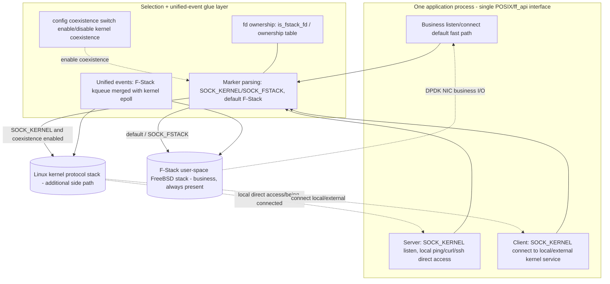

# 04 Architecture Design: Automatic Dual-Stack Coexistence + fd tri-state routing + dual-drive data flow + dual-stack unified events

> **Document ID**: SPEC-KE-04
> **Version**: v6 (native automatic dual-stack coexistence paradigm)
> **Date**: 2026-06-17
> **Status**: Drafting (v6 design)
> **Authoritative full text**: `zh_cn/04-architecture-design.md`. On conflict, code is authoritative.

> **v6 sync (key points; see `zh_cn/04-architecture-design.md` for full detail)**:
> - **Dual-layer switch**: compile macro `FF_KERNEL_COEXIST` (off by default → not compiled → zero regression) + runtime `kernel_coexist`.
> - **fd tri-state routing**: `ff_is_kernel_fd(fd)`(≥`FF_KERNEL_FD_BASE`=0x40000000) = kernel only (v5 `ff_host_*` path); else F-Stack path, and if `ff_native_map_get(fd)>0` also dual-drive host_fd (dual-stack); else single-stack F-Stack (zero regression).
> - **Dual-build/dual-drive data flow (v6)**: `ff_socket` default → `sys_socket`(s) + `ff_host_socket`(h) + `ff_native_map_set(s,h)`, return s; `ff_bind`/`ff_listen` drive both stacks; `ff_close` closes both + `ff_native_map_clear` + clears `ff_epoll_pairs`.
> - **native map (v6, to-be-implemented)**: `ff_native_fd_map[FF_MAX_FREEBSD_FILES]`(=65536), lock-free (single-threaded poll model), modeled on adapter `fstack_kernel_fd_map` (`ff_hook_syscall.c:258`); orthogonal to `ff_epoll_pairs[64]` (kq↔host_ep).
> - **accept single-stack ownership (Q3=A)**: dual-stack listen → try `kern_accept` (non-blocking); on success return F-Stack raw conn fd; on EAGAIN try `ff_host_accept(map[s])` → encode; only EAGAIN when both EAGAIN. Connection fds are single-stack.
> - **§connect dual-stack DRAFT (Q2=B, PENDING USER CONFIRMATION)**: semantic ambiguity (a single logical flow cannot duplex over both stacks); F-Stack primary + kernel concurrent connect for dual-network reachability. Use `SOCK_KERNEL` for pure-kernel client; kernel-primary/failover is future.
> - **native vs hook**: isomorphic (map / epoll merge / close linkage); divergent (socket/bind/listen/connect auto dual-build — v6 only; hook does NOT dual-build socket/listen).
> - **Hot path no regression (NFR-2)**: single-stack connection recv/send do a single `ff_is_kernel_fd` check, NOT consulting the map.
> - **Implementation status (D9)**: v6 dual-build/dual-drive/`ff_native_fd_map` NOT yet landed (`zh_cn/02 §5.2`).
>
> **R9 sync (key points; see `zh_cn/04-architecture-design.md §8bis` for full detail)**:
> - **kqueue coexistence (P2)**: `ff_kqueue/ff_kevent` symmetrically mimic `ff_epoll`, reusing `ff_epoll_pairs[kq→host_ep]` lazy pairing. `ff_kevent` changelist: for ident being a kernel fd (`ff_is_kernel_fd`) or dual-stack fd (`ff_native_map_get>0`), EV_ADD/EV_DELETE → `ff_host_epoll_ctl` on the paired host epoll (`EVFILT_READ↔EPOLLIN`/`EVFILT_WRITE↔EPOLLOUT`, `epoll_event.data`=app-side fd); kernel-only changes are NOT sent to the F-Stack kqueue. `ff_kevent` eventlist: first `ff_host_epoll_wait(timeout=0)` → synthesize `struct kevent` (`ident` restored from `data`, `filter`=READ/WRITE, `EV_EOF`↔`EPOLLHUP|ERR`), then `ff_kevent_do_each` for F-Stack events, merge counts. kqueue-fd close reuses `ff_epoll_close_pair`. Orthogonal to `ff_epoll_*` (each `ff_epoll_create` returns an independent kqueue). All `#ifdef FF_KERNEL_COEXIST`, macro-off byte-for-byte zero regression.
> - **IPv6 V6ONLY (P1)**: set `setsockopt(IPPROTO_IPV6, IPV6_V6ONLY, 1)` on the host IPv6 socket (placement decided by code measurement at impl: in `ff_socket` after dual-building the host IPv6 socket, or inside `ff_host_socket` for `domain==AF_INET6`). best-effort: eliminate the v4/v6 same-port conflict at the root while keeping host bind failures diagnosable; does not affect pure-kernel `SOCK_KERNEL` IPv6.
> - **Acceptance**: kqueue-model helloworld (coexist=1) kernel-side `curl 127.0.0.1:80=200 size=438` + F-Stack side `9.134.214.176:80=200` no regression; `-DINET6` helloworld (coexist=1) starts successfully (v4+v6 listen). R9 to-be-implemented.
>
> **R10 sync (key points; see `zh_cn/04-architecture-design.md §8ter` for full detail)**:
> - **readv/writev (D12)**: kernel fd → `ff_host_readv/writev(ff_kernel_fd_real(fd), iov, iovcnt)` (mimic `ff_read`/`ff_write`); connection fds single-stack, hot path one `ff_is_kernel_fd` check, no map lookup (NFR-2). `iov` passed as `void*` then cast.
> - **ioctl (D13)**: kernel fd uses the **raw Linux request** straight to `ff_host_ioctl` (NOT via `linux2freebsd_ioctl`; encodings differ Linux vs FreeBSD, `03` cross-validated); branch after `va_arg` for `argp`, before translation. **Dual-stack fd same-driver added in R10.1** (`FIONBIO`/`FIOASYNC` synced to the paired host fd, mirroring `ff_fcntl`; query ioctls like `FIONREAD` not forwarded).
> - **dup/dup2 (D14)**: `ff_dup` kernel fd → `ff_host_dup(real)`+encode (−1 if <0); `ff_dup2` both-kernel → `ff_host_dup2`+encode, **cross-stack rejected errno=EINVAL**, both-F-Stack keeps `sys_dup2`.
> - **select/poll (D15)**: **both NOT implemented, downgraded to a documented limitation (comment only)**. `ff_select`: encode kernel fd ≫ `FD_SETSIZE`(1024), cannot fit in `fd_set` (hard limit). `ff_poll`: merge complexity/regression risk too high, conservatively downgraded. Use `ff_epoll_*`/`ff_kqueue` (R9) for kernel-fd multiplexing.
> - All under `#ifdef FF_KERNEL_COEXIST`, runtime `kernel_coexist=0` short-circuit, macro-off byte-for-byte zero regression (impl landed, compiles, verified).
>
> **Scope**: dual-layer switch, automatic dual-stack model, fd tri-state routing, `ff_native_fd_map`, dual-drive data flow, dual-stack unified events, accept ownership, connect contract.
> **Basis**: `02` (code current state), `03` (external solutions); on conflict, code is authoritative.

---

## 1. Design Principles

1. **F-Stack always present (iron rule NFR-3)**: the application as a whole runs on F-Stack (`ff_init`/`ff_run` or LD_PRELOAD + an fstack instance); the business fast path **always** uses the F-Stack user-space stack; the kernel stack is merely an **additional** per-fd side path and **never** replaces/bypasses the F-Stack business plane.
2. **Reuse rather than rebuild**: hook-mode `FF_KERNEL_EVENT` (`02 §2`) already implements coexistence and is solidified as the primary baseline; nginx `kernel_network_stack` (`02 §3`) is an isomorphic reference.
3. **per-fd marker selection**: `socket()`/`ff_socket()`'s `type` with `SOCK_KERNEL` → kernel stack; default/`SOCK_FSTACK` → F-Stack. `SOCK_FSTACK` takes priority (when both set, F-Stack, `ff_hook_socket:387`).
4. **config coexistence-capability switch (coarse-grained, per-process)**: only controls "whether kernel-stack coexistence is enabled"; **does not change the default per-fd F-Stack semantics**; **no "whole-process default-to-kernel" option**.
5. **fd ownership + unified events**: ownership is fixed at creation; subsequent syscalls/events route by ownership; a single event loop merges F-Stack kqueue events + kernel epoll events.
6. **Default zero-overhead / zero regression**: when coexistence is not enabled or on the default/`SOCK_FSTACK` path, behavior is byte-for-byte identical to the original F-Stack (NFR-1).
7. **Unrelated to KNI**: no packet reinjection involved.

---

## 2. Overall Architecture (dual-stack coexistence within one process)



- **The business path (A1→F) is always F-Stack**; the kernel path (A2/A3→K) is a per-fd additional side path.
- hook mode: MK=`ff_hook_socket:387-390`, OWN=`is_fstack_fd:309`/`CHECK_FD_OWNERSHIP:57-61`, EV=`fstack_kernel_fd_map:257-258`+merge `:2324+`.
- native mode: MK/OWN/EV are this round's new design (lib-internal fd-ownership table + managed kernel fd + `ff_epoll_wait` merge), see §5.

---

## 3. Selection Model

### 3.1 Selection decision
```
if coexistence not enabled         -> all F-Stack (equivalent to original F-Stack, NFR-1)
otherwise per-fd:
   type has SOCK_KERNEL and !SOCK_FSTACK -> kernel stack (managed kernel fd)
   otherwise (default / SOCK_FSTACK)      -> F-Stack user-space stack
```
- **No "whole-process default-to-kernel"**: the coexistence switch only decides "whether the kernel side-path may be used"; the default is always per-fd F-Stack.

### 3.2 Selection implementation paradigm (hook: reuse code)
```c
/* ff_hook_socket (implemented, solidified reuse) */
if (fstack_territory(domain,type,proto)==0) return ff_linux_socket(...);   /* not the domain → kernel */
if ((type & SOCK_KERNEL) && !(type & SOCK_FSTACK)) {                       /* kernel stack */
    type &= ~SOCK_KERNEL; return ff_linux_socket(...);
}
type &= ~SOCK_FSTACK; /* → F-Stack business stack */
```

### 3.3 Isomorphic reference (nginx)
The process runs on F-Stack; a per-server `kernel_network_stack` → `belong_to_host`; dual event backends (kqueue primary + Linux epoll `ngx_ff_host_event_actions`) coexist in the same worker (`02 §3`) — proving the "same-process dual-stack + dual event backends" paradigm is mature and feasible.

---

## 4. Bidirectional Data Flow (coexistence)

### 4.1 Server direction
1. Business listen: `socket()` (default/`SOCK_FSTACK`) → F-Stack fd → `bind/listen` land on F-Stack → serve business via the DPDK NIC.
2. Kernel listen (coexisting): `socket(...|SOCK_KERNEL)` → managed kernel fd → `bind/listen` land on the kernel stack → local `ping`/`curl <kernel IP:port>` reach it directly, `accept` returns a kernel fd.
3. **Both kinds of listeners coexist in one process**, each stack's events delivered in the same epoll loop.

### 4.2 Client direction
1. Business client: default/`SOCK_FSTACK` → F-Stack fd → `connect` via F-Stack (DPDK NIC).
2. Kernel client (coexisting): `socket(...|SOCK_KERNEL)` → managed kernel fd → `connect` (`ff_hook_connect:858` by ownership) → `ff_linux_connect:144` → reaches 127.0.0.1/host IP/external kernel service.
3. Subsequent `send/recv/close` auto-split by ownership.

> Key: client and server share the "marker fixes the stack at creation, then route by ownership" mechanism; the business is always F-Stack, the kernel is an additional side path.

---

## 5. Dual-Stack Unified Event Model

### 5.1 Hook mode (reuse)
- External epoll; F-Stack side kqueue, kernel side epoll; `fstack_kernel_fd_map:257-258` maps F-Stack epoll fd ↔ kernel epoll fd.
- One `wait`: first take kernel events with `timeout=0`+throttle (`:2324+`/`:2333-2336`), then merge F-Stack events (`maxevents>=2` `:2212-2218`).
- `close` linkage releases both stacks' fds (`:1874-1883`).

### 5.2 Native mode (new design)
- A new fd-ownership scheme (a managed kernel fd is `host_fd + FF_KERNEL_FD_BASE`, above the FreeBSD fd range, so the two never collide).
- `ff_socket(SOCK_KERNEL)` creates a **managed kernel fd** via `ff_host_interface` (registered for ownership, not exposing a raw bypass).
- `ff_epoll_create` returns the F-Stack kqueue; a host epoll is lazily created and paired when a kernel fd is first added.
- `ff_epoll_ctl`: kernel fd → host `epoll_ctl` on the paired host epoll; F-Stack fd → `ff_kevent`.
- `ff_epoll_wait`: first poll the host epoll with `timeout=0` (non-blocking), then `ff_kevent_do_each` for F-Stack events, merging the results.
- `ff_close` releases by ownership and clears the ownership entry.
- The default/`SOCK_FSTACK` path goes entirely through the original `ff_socket`/`ff_epoll.c`, byte-for-byte zero regression.

---

## 6. Kernel - User-Space Stack Coexistence Matrix

| Dimension | F-Stack user-space stack (business, default) | Kernel stack (additional side path) |
|---|---|---|
| Carrier | DPDK PMD + FreeBSD stack | Linux kernel protocol stack |
| Traffic | Business fast path | Local/management/client connecting to local or external kernel services |
| Selection trigger | default / `SOCK_FSTACK` | `SOCK_KERNEL` (requires coexistence enabled) |
| Events | `ff_kqueue`/`ff_kevent` | `epoll` (host) |
| Can it be bypassed | **No (always present)** | Additional only, can be disabled |

---

## 7. Selection and Trade-offs

| Option | Adopted? | Reason |
|---|---|---|
| **Solidify hook FF_KERNEL_EVENT coexistence** | ✓ **primary baseline** | Already implements coexistence (`02 §2`), app on F-Stack + per-fd kernel side path |
| **Native ff_api unified-event coexistence** | ✓ **new design** | Lets natively-linked applications also coexist over both stacks in one process |
| **nginx kernel_network_stack** | ✓ reference | Isomorphic dual event backends, proves feasibility |
| v3 `ff_host_socket` raw kernel bypass | ✗ **deprecated** | Bypasses F-Stack, violates the coexistence iron rule (NFR-3) |
| whole-process `default_stack=kernel` | ✗ **deprecated** | anti-F-Stack |
| `ff_local_*` dual API / thread-level selection / KNI reinjection | ✗ | does not match the requirement / out of the problem domain |

**Conclusion**: with **hook FF_KERNEL_EVENT coexistence as the primary baseline + native unified-event coexistence as the new design** as the skeleton, per-fd markers + a config coexistence switch, covering server/client directions and hook/native modes, with F-Stack always present.

---

## 8. Blast Radius
- This phase (R1): docs only.
- Implementation phase: (a) hook mode re-verify/solidify + a correct coexistence demo (small change, mostly reuse); (b) lib adds native unified-event coexistence (fd-ownership table + managed kernel fd + `ff_epoll_*` merge, concentrated in `ff_epoll.c`/`ff_syscall_wrapper.c ff_socket`/`ff_host_interface` managed bridge); (c) `ff_config.{c,h}` coexistence-capability switch; the default path has zero regression, avoiding the packet fast-path hotspots.

---

## 9. Open Questions (deferred to 05/06)
- The concrete data structures and placement of the native unified-event ownership table and managed kernel fd (`ff_epoll.c` vs a new file).
- The config coexistence switch naming (`[stack] kernel_coexist=0/1`, etc.) and default value (default off).
- The fd-space distinction between native managed kernel fds and F-Stack fds (mimic the nginx `ngx_max_sockets` offset / mimic the hook encoded offset).
