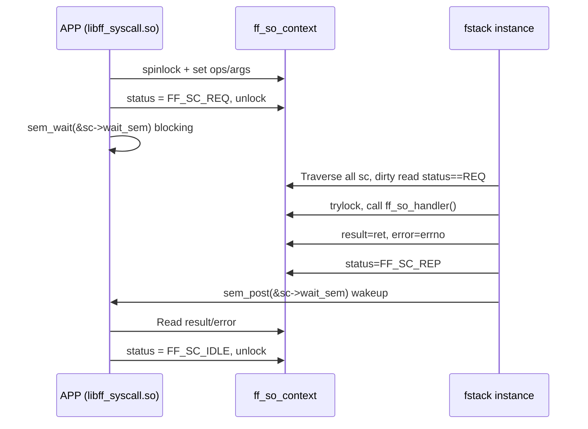
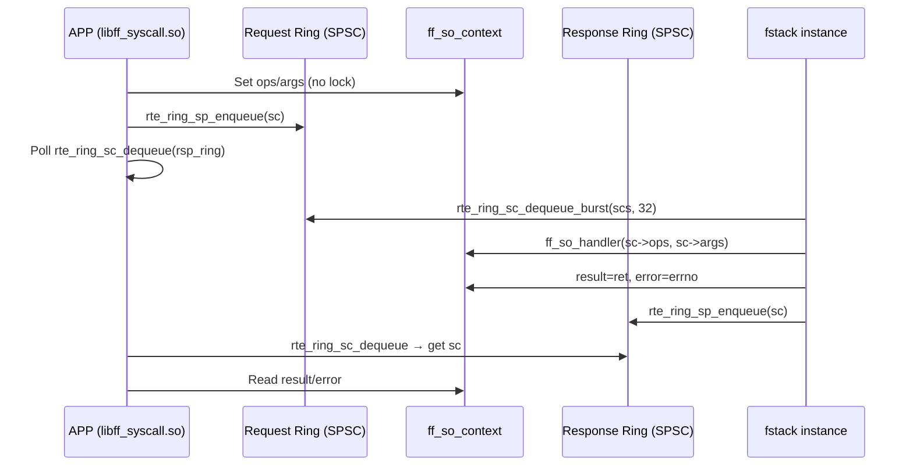

# F-Stack LD_PRELOAD Lock-Free Ring Queue Transformation — Architecture Design Document

> **Document ID**: SPEC-002  
> **Version**: v1.0 Draft  
> **Date**: 2026-03-27  
> **Status**: Reviewed by fengbojiang 2026.03.27, no issues found with overall architecture, details to be adjusted during implementation if needed  
> **Prerequisite Document**: SPEC-001 Requirements Specification

---

## 1. Existing Architecture Analysis

### 1.1 Component Topology

```
┌─────────────────────────────────────────────────────────┐
│               User Application (e.g. Nginx)              │
│                                                          │
│  socket() / read() / write() / epoll_wait() / ...       │
└────────────────────┬────────────────────────────────────┘
                     │  LD_PRELOAD interception
                     ▼
┌─────────────────────────────────────────────────────────┐
│              libff_syscall.so (APP side)                  │
│                                                          │
│  ff_hook_syscall.c:                                     │
│    ff_hook_socket() / ff_hook_read() / ff_hook_write()  │
│    ff_hook_epoll_wait() / kevent()                      │
│                                                          │
│  Synchronization mechanism:                              │
│    ① ACQUIRE_ZONE_LOCK(FF_SC_IDLE) — spin wait + spinlock│
│    ② Fill sc->ops, sc->args                             │
│    ③ RELEASE_ZONE_LOCK(FF_SC_REQ) — set status + unlock │
│    ④ sem_wait(&sc->wait_sem) — block waiting  ←───────┐ │
│    ⑤ Read sc->result, set FF_SC_IDLE              │   │
└────────────────────┬─────────────────────────────┐│   │
                     │  Hugepage shared memory      ││   │
                     ▼                              ││   │
┌─────────────────────────────────────────────┐    ││   │
│         ff_so_context (shared memory)        │    ││   │
│                                              │    ││   │
│  ┌─ CACHE LINE 0 ──────────────────────┐    │    ││   │
│  │ ops        : FF_SOCKET_OPS enum     │    │    ││   │
│  │ status     : IDLE / REQ / REP       │    │    ││   │
│  │ args       : void* (request params) │    │    ││   │
│  │ lock       : rte_spinlock_t         │    │    ││   │
│  │ error      : int                    │    │    ││   │
│  │ result     : int                    │    │    ││   │
│  │ idx        : int                    │    │    ││   │
│  │ wait_sem   : sem_t (32 bytes) ──────┼────┼──┘ │   │
│  └─────────────────────────────────────┘    │    │   │
│  ┌─ CACHE LINE 1 ──────────────────────┐    │    │   │
│  │ refcount   : int                    │    │    │   │
│  │ ff_thread_handle : void*            │    │    │   │
│  │ forking    : volatile int           │    │    │   │
│  └─────────────────────────────────────┘    │    │   │
└─────────────────────────────────────────────┘    │   │
                     │                              │   │
                     ▼                              │   │
┌─────────────────────────────────────────────────────────┐
│              fstack instance process                     │
│                                                          │
│  ff_socket_ops.c:                                       │
│    ff_handle_each_context():                            │
│      rte_spinlock_lock(&ff_so_zone->lock)  ←global lock │
│      for (i=0; i<count; i++):    ←O(n) traversal       │
│        if (sc->status == FF_SC_REQ):  ← dirty read     │
│          ff_handle_socket_ops(sc)                       │
│            trylock(sc->lock)                            │
│            ff_so_handler(sc->ops, sc->args) → F-Stack   │
│            sc->result = ret; sc->error = errno          │
│            sem_post(&sc->wait_sem)   →wake APP ─────────┘
│      rte_spinlock_unlock(&ff_so_zone->lock)             │
│                                                          │
│  fstack.c:                                              │
│    ff_run(loop) → ff_handle_each_context() per cycle    │
└─────────────────────────────────────────────────────────┘
```

### 1.2 Current State Machine

```
         APP side                    fstack side
         ────────                    ───────────
    ┌─────────────┐
    │  FF_SC_IDLE  │◄───────────────────────────────────┐
    └──────┬──────┘                                      │
           │ ACQUIRE_ZONE_LOCK(IDLE)                     │
           │ set ops/args                                │
           │ RELEASE_ZONE_LOCK(REQ)                      │
           ▼                                             │
    ┌─────────────┐                                      │
    │  FF_SC_REQ   │─── sc pointer in shared memory ───► │
    └──────┬──────┘                                      │
           │                    dirty read sc->status == REQ │
           │ sem_wait()         trylock → process → set result │
           │ (block waiting)    sem_post() wakeup           │
           ▼                              │              │
    ┌─────────────┐◄──────────────────────┘              │
    │  FF_SC_REP   │                                      │
    └──────┬──────┘                                      │
           │ Read result/error                            │
           │ sc->status = FF_SC_IDLE                     │
           └─────────────────────────────────────────────┘
```

### 1.3 Key Performance Issues

| Issue | Location | Impact |
|---|---|---|
| sem_wait/sem_post kernel mode switch | hook:2265/2270, ops:557 | Extra 200-500ns per syscall |
| sem_timedwait poor timeout precision | hook:2265, 2555 | epoll_wait wakeup delay 1-4ms |
| O(n) context traversal | ops:594-616 | Dirty reads on all 32 sc entries, cache pollution |
| Global spinlock holding | ops:586-631 | Lock held throughout entire polling loop, blocks APP attach/detach |
| sem timeout race condition | hook:2224-2229 | Post-timeout sem_post causes false return next time |
| Unreliable alarm compensation | hook:3235-3252 | Only 1/5 example programs use it |

---

## 2. New Architecture Design: Dual Ring SPSC Model

### 2.1 Architecture Overview

```
┌─────────────────────────────────────────────────────────┐
│                   User Application                       │
└────────────────────┬────────────────────────────────────┘
                     │  LD_PRELOAD
                     ▼
┌─────────────────────────────────────────────────────────┐
│              libff_syscall.so (APP side)                  │
│                                                          │
│  Request path:                                           │
│    ① Fill sc->ops, sc->args (no lock needed)            │
│    ② rte_ring_sp_enqueue(req_ring, sc)                  │
│                                                          │
│  Wait path (configurable strategy):                      │
│    busy-poll : while (rte_ring_sc_dequeue(rsp_ring)==-1)│
│    yield-poll: same + rte_pause()                       │
│    eventfd   : eventfd_read() blocking                  │
│                                                          │
│  Response path:                                          │
│    ③ rte_ring_sc_dequeue(rsp_ring, &sc)                 │
│    ④ Read sc->result, sc->error                        │
└──────┬──────────────────────────────────────┬───────────┘
       │                                      │
       ▼                                      ▼
┌──────────────┐                    ┌──────────────┐
│  Request Ring │                    │  Response Ring│
│  (SPSC)      │                    │  (SPSC)      │
│              │                    │              │
│ APP produces │                    │ fstack       │
│ fstack       │                    │ produces     │
│ consumes     │                    │ APP consumes │
│              │                    │              │
│ rte_ring     │                    │ rte_ring     │
│ Hugepage     │                    │ Hugepage     │
└──────┬───────┘                    └──────┬───────┘
       │                                   │
       ▼                                   │
┌─────────────────────────────────────────────────────────┐
│              fstack instance process                     │
│                                                          │
│  ff_handle_each_context() transformation:               │
│    nb = rte_ring_sc_dequeue_burst(req_ring, scs, 32)    │
│    for (i=0; i<nb; i++):                                │
│      ff_handle_socket_ops(scs[i])  ← O(1) direct proc  │
│      rte_ring_sp_enqueue(rsp_ring, scs[i]) ────────────┘│
│                                                          │
│  Optimization: Eliminate global ff_so_zone->lock         │
│  Optimization: Eliminate O(n) traversal                  │
│  Optimization: Eliminate sem_flag / sem_post             │
└─────────────────────────────────────────────────────────┘
```

### 2.2 Ring Zone Structure Design

```
ff_sc_ring_zone (one per fstack instance, on Hugepage)
┌──────────────────────────────────────────────────────┐
│  ┌─ CACHE LINE 0 ─────────────────────────────────┐  │
│  │  req_ring : struct rte_ring* (request queue ptr)│  │
│  │  rsp_ring : struct rte_ring* (response queue ptr)│ │
│  │  ring_size: uint32_t (capacity, default 64)     │  │
│  │  wait_mode: uint8_t (0=busy, 1=yield, 2=evfd)  │  │
│  │  eventfd_req: int (APP->fstack eventfd, mode=2) │  │
│  │  eventfd_rsp: int (fstack->APP eventfd, mode=2) │  │
│  └────────────────────────────────────────────────┘  │
│                                                      │
│  Request Ring (rte_ring, SPSC):                      │
│  ┌─────┬─────┬─────┬─────┬──────────────┐          │
│  │ sc* │ sc* │ sc* │ ... │ (capacity=64)│          │
│  └─────┴─────┴─────┴─────┴──────────────┘          │
│  APP sp_enqueue ──────► fstack sc_dequeue            │
│                                                      │
│  Response Ring (rte_ring, SPSC):                     │
│  ┌─────┬─────┬─────┬─────┬──────────────┐          │
│  │ sc* │ sc* │ sc* │ ... │ (capacity=64)│          │
│  └─────┴─────┴─────┴─────┴──────────────┘          │
│  fstack sp_enqueue ──────► APP sc_dequeue            │
└──────────────────────────────────────────────────────┘
```

### 2.3 New State Machine

```
         APP side                    fstack side
         ────────                    ───────────

    ① Fill sc->ops, sc->args
    ② rte_ring_sp_enqueue(req_ring, sc)
                     │
                     ▼
            ┌────────────────┐
            │  Request Ring   │
            └───────┬────────┘
                    │
                    ▼ rte_ring_sc_dequeue_burst()
            ff_handle_socket_ops(sc)
              → ff_so_handler(sc->ops, sc->args)
              → sc->result = ret
              → sc->error = errno
              → rte_ring_sp_enqueue(rsp_ring, sc)
                    │
                    ▼
            ┌────────────────┐
            │  Response Ring  │
            └───────┬────────┘
                    │
                    ▼ 
    rte_ring_sc_dequeue()
    ③ Read sc->result, sc->error

Notes:
- No longer need FF_SC_IDLE/REQ/REP state machine transitions
- No longer need spinlock protection (ring itself is lock-free)
- sc lifecycle is implicitly managed by ring enqueue/dequeue:
  "in req_ring" = request submitted
  "in rsp_ring" = response ready
  "not in either ring" = idle
```

### 2.4 State Semantic Migration Comparison

| Old State | Old Meaning | Ring Equivalent | New Implementation |
|---|---|---|---|
| `FF_SC_IDLE` | sc idle, can submit request | sc not in any ring | No explicit setting needed |
| `FF_SC_REQ` | Request submitted, waiting for processing | sc in req_ring | `rte_ring_sp_enqueue` |
| `FF_SC_REP` | Processing complete, result ready | sc in rsp_ring | `rte_ring_sp_enqueue` |

> **Retain status field**: For debugging and backward compatibility, the `sc->status` field is retained but only used for debug logging, not participating in synchronization logic.

---

## 3. Core Transformation Plan

### 3.1 ff_handle_each_context() Transformation

**Current implementation** (`ff_socket_ops.c:569-638`):
```c
// Problem: global lock + O(n) traversal
rte_spinlock_lock(&ff_so_zone->lock);
for (i = 0; i < ff_so_zone->count; i++) {
    if (sc->status == FF_SC_REQ)
        ff_handle_socket_ops(sc);  // internal trylock
}
rte_spinlock_unlock(&ff_so_zone->lock);
```

**New implementation plan**:

```c
void ff_handle_each_context()
{
    struct ff_so_context *scs[32];
    unsigned int nb;

    // Calculate time window (maintain pkt_tx_delay semantics)
    cur_tsc = rte_rdtsc();

    while (1) {
        // O(1) batch dequeue — replaces O(n) traversal
        nb = rte_ring_sc_dequeue_burst(ring_zone->req_ring,
            (void **)scs, 32, NULL);

        for (i = 0; i < nb; i++) {
            // Direct processing, no trylock needed (SPSC guarantees no contention)
            ff_handle_socket_ops_ring(scs[i]);
        }

        diff_tsc = rte_rdtsc() - cur_tsc;
        if (diff_tsc >= drain_tsc) break;
        rte_pause();
    }
}
```

**Key improvements**:
- Eliminate `ff_so_zone->lock` global lock
- O(n) → O(1) request acquisition (`rte_ring_dequeue_burst`)
- Eliminate double locking (no longer need `rte_spinlock_trylock(&sc->lock)`)
- Maintain `drain_tsc` time window multi-poll behavior

### 3.2 ff_handle_socket_ops() Transformation

**Current implementation** (`ff_socket_ops.c:502-567`):
```c
static inline void ff_handle_socket_ops(struct ff_so_context *sc) {
    if (!rte_spinlock_trylock(&sc->lock)) return;   // lock
    if (sc->status != FF_SC_REQ) { unlock; return; }  // double check
    sc->result = ff_so_handler(sc->ops, sc->args);
    sc->error = errno;
    // sem_flag check + sem_post or polling mode set REP
    sem_post(&sc->wait_sem);  // wake APP
    rte_spinlock_unlock(&sc->lock);
}
```

**New implementation plan**:
```c
static inline void ff_handle_socket_ops_ring(struct ff_so_context *sc) {
    // No lock needed (dequeue from ring guarantees exclusive access)
    sc->result = ff_so_handler(sc->ops, sc->args);
    sc->error = errno;
    // Directly enqueue to response ring (replaces sem_post)
    rte_ring_sp_enqueue(ring_zone->rsp_ring, sc);
    // If wait_mode == eventfd, also write eventfd to notify
    if (ring_zone->wait_mode == FF_RING_WAIT_EVENTFD) {
        uint64_t val = 1;
        write(ring_zone->eventfd_rsp, &val, sizeof(val));
    }
}
```

**Key improvements**:
- Eliminate `rte_spinlock_trylock` and double check (ring dequeue already guarantees request validity)
- Eliminate `sem_flag` judgment logic
- Unify sem_post / polling two paths

### 3.3 APP-Side SYSCALL Macro Transformation

**Current implementation** (`ff_hook_syscall.c:148-160`):
```c
#define SYSCALL(op, arg) do {
    ACQUIRE_ZONE_LOCK(FF_SC_IDLE);   // spin wait IDLE + lock
    sc->ops = (op); sc->args = (arg);
    RELEASE_ZONE_LOCK(FF_SC_REQ);    // set REQ + unlock
    ACQUIRE_ZONE_LOCK(FF_SC_REP);    // spin wait REP + lock
    ret = sc->result;
    RELEASE_ZONE_LOCK(FF_SC_IDLE);   // set IDLE + unlock
} while (0)
```

**New implementation plan**:
```c
#define SYSCALL_RING(op, arg) do {
    sc->ops = (op);
    sc->args = (arg);
    rte_ring_sp_enqueue(ring_zone->req_ring, sc);   // enqueue request
    ff_ring_wait_response(ring_zone, sc);             // wait for response
    ret = sc->result;
} while (0)
```

Where `ff_ring_wait_response()` selects wait strategy based on `wait_mode`:
```c
static inline void ff_ring_wait_response(
    struct ff_sc_ring_zone *rz, struct ff_so_context *expect_sc)
{
    void *out;
    switch (rz->wait_mode) {
    case FF_RING_WAIT_BUSY_POLL:
        while (rte_ring_sc_dequeue(rz->rsp_ring, &out) != 0)
            ;  // busy spin
        break;
    case FF_RING_WAIT_YIELD_POLL:
        while (rte_ring_sc_dequeue(rz->rsp_ring, &out) != 0)
            rte_pause();
        break;
    case FF_RING_WAIT_EVENTFD:
        while (rte_ring_sc_dequeue(rz->rsp_ring, &out) != 0) {
            uint64_t val;
            read(rz->evfd, &val, sizeof(val));
        }
        break;
    }
    assert(out == expect_sc);  // SPSC guarantees ordering
}
```

### 3.4 epoll_wait / kevent Timeout Transformation

**Current issue**: `sem_timedwait` relies on `CLOCK_REALTIME`, poor precision.

**New approach**: Use `rte_rdtsc()` for high-precision timing:
```c
// Replaces sem_timedwait
uint64_t tsc_hz = rte_get_tsc_hz();
uint64_t deadline_tsc = rte_rdtsc() + (uint64_t)timeout_ms * tsc_hz / 1000;

while (rte_ring_sc_dequeue(rsp_ring, &out) != 0) {
    if (rte_rdtsc() >= deadline_tsc) {
        ret = 0;  // timeout, no events
        goto epoll_exit;
    }
    rte_pause();
}
```

**Key improvements**:
- Nanosecond-level timeout precision (TSC frequency typically 2-3 GHz)
- Not affected by NTP time adjustments
- Eliminates sem_timedwait post-timeout sem_post race condition

### 3.5 alarm_event_sem Replacement Plan

**Current issue**: `alarm_event_sem()` is designed to compensate when APP has already entered `sem_wait` but fstack hasn't called `sem_post` in time.

**No longer needed under ring scheme**:
- In ring mode, APP side polls dequeue (not kernel blocking), so "unable to wake in time" doesn't exist
- fstack side immediately enqueues to response ring after processing, APP gets it on next dequeue
- `alarm_event_sem()` becomes an empty function (maintains API compatibility) or is excluded by conditional compilation

---

## 4. Industry Solution Comparison

| Dimension | F-Stack Current (sem) | F-Stack New (ring) | VPP memif | VPP svm_msg_q |
|---|---|---|---|---|
| **Queue Type** | None (state machine polling) | DPDK rte_ring (SPSC) | Custom ring (head/tail) | Shared memory msg_q |
| **Sync Method** | sem_wait/sem_post | Lock-free CAS | Atomic head/tail | mutex + condvar |
| **Notification** | futex wakeup | Polling/eventfd selectable | eventfd/polling | eventfd |
| **Request Dispatch** | O(n) traverse all sc | O(1) ring dequeue | O(1) ring dequeue | O(1) msg dequeue |
| **Timeout Impl** | sem_timedwait (CLOCK_REALTIME) | rte_rdtsc() high precision | epoll_wait(eventfd) | timedwait |
| **Zero-copy** | Shared memory args | Shared memory args | Shared memory buffer | Shared memory FIFO |
| **CPU Overhead** | Low (blocking wait) | Configurable | Configurable | Medium |
| **Complexity** | Medium (sem + spinlock) | Low (ring only) | High (custom protocol) | High |

**Rationale for choosing rte_ring**:
1. F-Stack already extensively uses `rte_ring` (dispatch_ring, msg_ring), zero learning cost
2. DPDK natively supports SPSC mode, no need to develop custom lock-free algorithms
3. Proven cross-process sharing capability (Hugepage + rte_memzone)
4. Simpler than VPP's custom solutions, more suitable for F-Stack's 1:1 binding model

---

## 5. Compile Macro Strategy

### 5.1 Macro Definition

```makefile
# New addition in Makefile:
# Enable lock-free ring IPC (replaces semaphore)
#FF_USE_RING_IPC=1
```

### 5.2 Conditional Compilation in Code

```c
// ff_socket_ops.h
#ifdef FF_USE_RING_IPC
  #include <rte_ring.h>
  // New ring_zone structure and ring-related declarations
#else
  #include <semaphore.h>
  // Retain original sem_t wait_sem
#endif
```

### 5.3 Relationship with Existing Macros

| Existing Macro | Behavior Under Ring Mode |
|---|---|
| `FF_PRELOAD_POLLING_MODE` | **Deprecated**: ring scheme's `busy-poll` strategy is equivalent |
| `FF_THREAD_SOCKET` | **Compatible**: per-thread independent ring pair |
| `FF_KERNEL_EVENT` | **Compatible**: ring dequeue + linux_epoll_wait |
| `FF_MULTI_SC` | **Compatible**: multiple ring zones |
| `FF_USE_THREAD_STRUCT_HANDLE` | **Compatible**: no changes |

---

## 6. Ring Capacity and Performance Configuration

### 6.1 Default Configuration

| Parameter | Default Value | Description |
|---|---|---|
| `ring_size` | 64 | Must be power of 2, covers SOCKET_OPS_CONTEXT_MAX_NUM(32) |
| `wait_mode` | 1 (yield-poll) | Balances latency and CPU |
| `evfd` | -1 | Only effective in eventfd mode |

### 6.2 Configuration Methods

Environment variable (runtime):
```bash
export FF_RING_WAIT_MODE=0    # 0=busy, 1=yield, 2=eventfd
```

Or via `config.ini` extension (future):
```ini
[freebsd.boot]
ring_wait_mode=1
```

---

## 7. Memory Layout

### 7.1 Hugepage Allocation

```
rte_memzone: "ff_socket_ops_zone_0"  (existing)
├── ff_socket_ops_zone structure
└── ff_so_context[0..31] array

rte_ring: "ff_sc_req_ring_0"  (new)
└── rte_ring structure + 64 entries × sizeof(void*)

rte_ring: "ff_sc_rsp_ring_0"  (new)
└── rte_ring structure + 64 entries × sizeof(void*)
```

### 7.2 Cache Line Optimization

- Request ring's `prod.head/prod.tail` exclusively written by APP (no contention with fstack)
- Request ring's `cons.head/cons.tail` exclusively written by fstack
- Under SPSC mode, head/tail are naturally on different cache lines, no false sharing
- `rte_ring` internally guarantees cache line alignment

---

## 8. Error Handling and Fault Tolerance

### 8.1 Ring Full Handling

When request ring is full (APP sending requests too fast, fstack can't keep up):

```c
// APP side
while (rte_ring_sp_enqueue(req_ring, sc) != 0) {
    ERR_LOG("req_ring full, waiting...\n");
    rte_pause();
}
```

This is semantically equivalent to the current `ACQUIRE_ZONE_LOCK(FF_SC_IDLE)` spin wait.

### 8.2 Process Exit Cleanup

```c
// ff_detach_so_context() enhancement
void ff_detach_so_context(struct ff_so_context *sc) {
    #ifdef FF_USE_RING_IPC
    // Drain residual items belonging to this sc from response ring
    void *tmp;
    while (rte_ring_sc_dequeue(ring_zone->rsp_ring, &tmp) == 0) {
        if (tmp == sc) break;
        // Re-enqueue other sc (theoretically shouldn't happen with SPSC)
    }
    #endif
    // Original cleanup logic...
}
```

### 8.3 Ring Creation Failure Fallback

```c
int ff_create_sc_ring_zone(int proc_id) {
    ring_zone->req_ring = rte_ring_create(name, size, socket_id,
        RING_F_SP_ENQ | RING_F_SC_DEQ);
    if (ring_zone->req_ring == NULL) {
        ERR_LOG("Failed to create req_ring, falling back to sem\n");
        return -1;  // Caller falls back to semaphore mode
    }
    // ...
}
```

---

## 9. Risks and Mitigations

| Risk | Probability | Impact | Mitigation |
|---|---|---|---|
| rte_ring not visible across processes | Low | Fatal | Ring allocated via rte_memzone, verified |
| SPSC assumption violated | Medium | Data corruption | Strict checking: each sc bound to one ring pair |
| Ring full causing deadlock | Low | Response delay | ring_size=64 far exceeds concurrent request count |
| eventfd mode performance degradation | Medium | Higher latency | Default yield-poll, eventfd only as fallback |
| Incompatible with future DPDK versions | Low | Build failure | rte_ring API is highly stable |

---

## Appendix: Mermaid Sequence Diagrams

### Existing Flow (Semaphore Mode)



### New Flow (Lock-Free Ring Mode)


