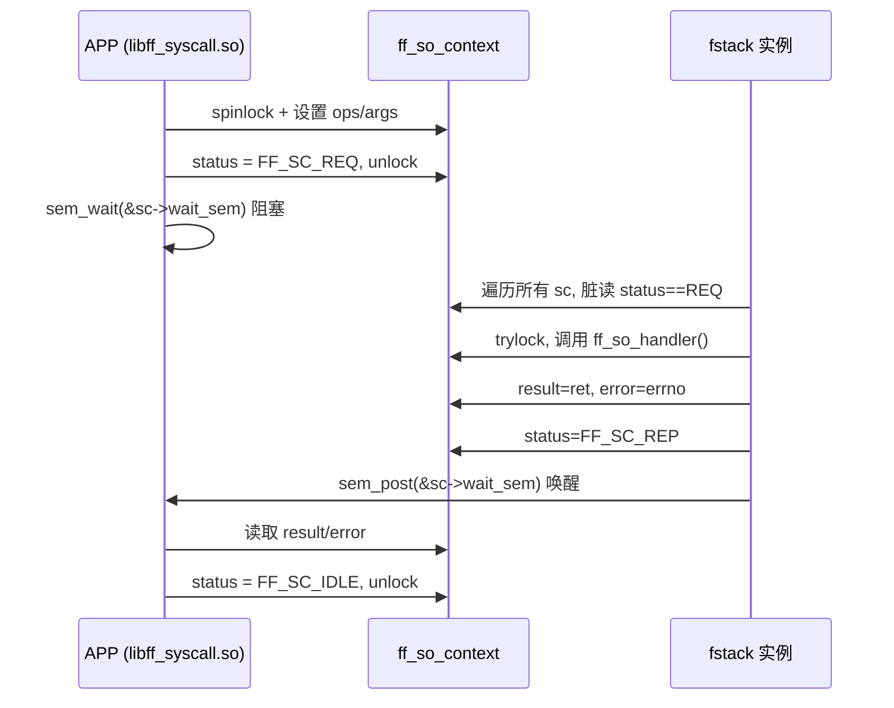
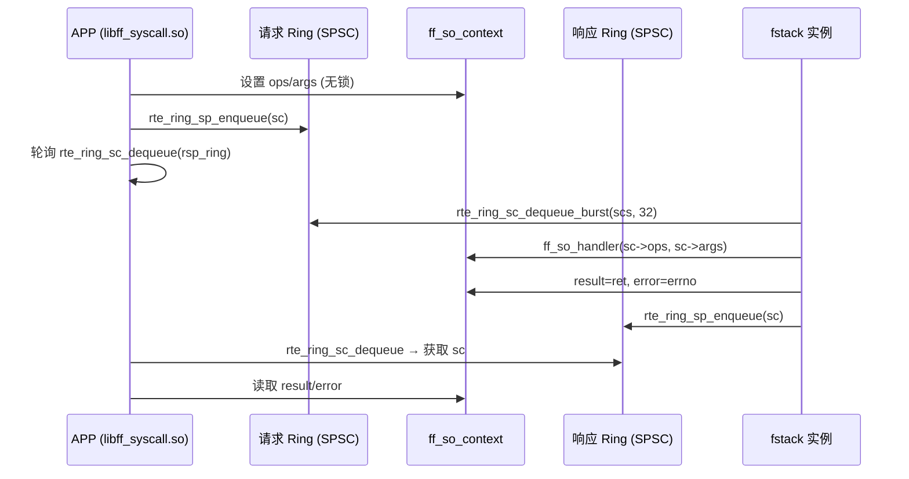

# F-Stack LD_PRELOAD 无锁环形队列改造 — 架构设计文档

> **文档编号**: SPEC-002  
> **版本**: v1.0 Draft  
> **日期**: 2026-03-27  
> **状态**: 已评审 by fengbojiang 2026.03.27，大的架构没看到什么问题，细节后续实现有问题再进行调整
> **前置文档**: SPEC-001 需求规格文档

---

## 1. 现有架构分析

### 1.1 组件拓扑

```
┌─────────────────────────────────────────────────────────┐
│                   用户应用程序 (e.g. Nginx)               │
│                                                          │
│  socket() / read() / write() / epoll_wait() / ...       │
└────────────────────┬────────────────────────────────────┘
                     │  LD_PRELOAD 劫持
                     ▼
┌─────────────────────────────────────────────────────────┐
│              libff_syscall.so (APP 侧)                   │
│                                                          │
│  ff_hook_syscall.c:                                     │
│    ff_hook_socket() / ff_hook_read() / ff_hook_write()  │
│    ff_hook_epoll_wait() / kevent()                      │
│                                                          │
│  同步机制:                                               │
│    ① ACQUIRE_ZONE_LOCK(FF_SC_IDLE) — 自旋等待 + spinlock│
│    ② 填充 sc->ops, sc->args                             │
│    ③ RELEASE_ZONE_LOCK(FF_SC_REQ) — 设状态 + 解锁       │
│    ④ sem_wait(&sc->wait_sem) — 阻塞等待响应 ←───────┐   │
│    ⑤ 读取 sc->result, 设 FF_SC_IDLE                │   │
└────────────────────┬─────────────────────────────┐  │   │
                     │  Hugepage 共享内存            │  │   │
                     ▼                              │  │   │
┌─────────────────────────────────────────────┐    │  │   │
│         ff_so_context (共享内存)              │    │  │   │
│                                              │    │  │   │
│  ┌─ CACHE LINE 0 ──────────────────────┐    │    │  │   │
│  │ ops        : FF_SOCKET_OPS enum     │    │    │  │   │
│  │ status     : IDLE / REQ / REP       │    │    │  │   │
│  │ args       : void* (请求参数)        │    │    │  │   │
│  │ lock       : rte_spinlock_t         │    │    │  │   │
│  │ error      : int                    │    │    │  │   │
│  │ result     : int                    │    │    │  │   │
│  │ idx        : int                    │    │    │  │   │
│  │ wait_sem   : sem_t (32 bytes) ──────┼────┼──┘ │   │
│  └─────────────────────────────────────┘    │    │   │
│  ┌─ CACHE LINE 1 ──────────────────────┐    │    │   │
│  │ refcount   : int                    │    │    │   │
│  │ ff_thread_handle : void*            │    │    │   │
│  │ forking    : volatile int           │    │    │   │
│  └─────────────────────────────────────┘    │    │   │
└─────────────────────────────────────────────┘    │   │
                     │                              │   │
                     ▼                              │   │
┌─────────────────────────────────────────────────────────┐
│              fstack 实例进程                              │
│                                                          │
│  ff_socket_ops.c:                                       │
│    ff_handle_each_context():                            │
│      rte_spinlock_lock(&ff_so_zone->lock)    ←全局锁    │
│      for (i=0; i<count; i++):    ←O(n) 遍历             │
│        if (sc->status == FF_SC_REQ):  ← 脏读            │
│          ff_handle_socket_ops(sc)                       │
│            trylock(sc->lock)                            │
│            ff_so_handler(sc->ops, sc->args) → F-Stack   │
│            sc->result = ret; sc->error = errno          │
│            sem_post(&sc->wait_sem)   →唤醒 APP ─────────┘
│      rte_spinlock_unlock(&ff_so_zone->lock)             │
│                                                          │
│  fstack.c:                                              │
│    ff_run(loop) → ff_handle_each_context() 每周期调用   │
└─────────────────────────────────────────────────────────┘
```

### 1.2 当前状态机

```
         APP 侧                   fstack 侧
         ──────                   ──────────
    ┌─────────────┐
    │  FF_SC_IDLE  │◄───────────────────────────────────┐
    └──────┬──────┘                                      │
           │ ACQUIRE_ZONE_LOCK(IDLE)                     │
           │ set ops/args                                │
           │ RELEASE_ZONE_LOCK(REQ)                      │
           ▼                                             │
    ┌─────────────┐                                      │
    │  FF_SC_REQ   │─── sc 指针在共享内存中 ───►          │
    └──────┬──────┘                                      │
           │                    脏读 sc->status == REQ    │
           │ sem_wait()         trylock → 处理 → 设 result │
           │ (阻塞等待)         sem_post() 唤醒            │
           ▼                              │              │
    ┌─────────────┐◄──────────────────────┘              │
    │  FF_SC_REP   │                                      │
    └──────┬──────┘                                      │
           │ 读取 result/error                            │
           │ sc->status = FF_SC_IDLE                     │
           └─────────────────────────────────────────────┘
```

### 1.3 关键性能问题

| 问题 | 位置 | 影响 |
|---|---|---|
| sem_wait/sem_post 内核态切换 | hook:2265/2270, ops:557 | 每次 syscall 额外 200-500ns |
| sem_timedwait 超时精度差 | hook:2265, 2555 | epoll_wait 唤醒延迟 1-4ms |
| O(n) context 遍历 | ops:594-616 | 32 个 sc 全部脏读，cache 污染 |
| 全局 spinlock 持有 | ops:586-631 | 整个轮询循环持锁，阻塞 APP attach/detach |
| sem 超时竞态 | hook:2224-2229 | 超时后 sem_post 导致下次误返回 |
| alarm 补偿不可靠 | hook:3235-3252 | 仅 1/5 示例程序使用 |

---

## 2. 新架构设计：双 Ring SPSC 模型

### 2.1 架构总览

```
┌─────────────────────────────────────────────────────────┐
│                   用户应用程序                            │
└────────────────────┬────────────────────────────────────┘
                     │  LD_PRELOAD
                     ▼
┌─────────────────────────────────────────────────────────┐
│              libff_syscall.so (APP 侧)                   │
│                                                          │
│  请求路径:                                               │
│    ① 填充 sc->ops, sc->args (无需加锁)                  │
│    ② rte_ring_sp_enqueue(req_ring, sc)                  │
│                                                          │
│  等待路径 (可配置策略):                                   │
│    busy-poll : while (rte_ring_sc_dequeue(rsp_ring)==-1)│
│    yield-poll: 同上 + rte_pause()                       │
│    eventfd   : eventfd_read() 阻塞                      │
│                                                          │
│  响应路径:                                               │
│    ③ rte_ring_sc_dequeue(rsp_ring, &sc)                 │
│    ④ 读取 sc->result, sc->error                        │
└──────┬──────────────────────────────────────┬───────────┘
       │                                      │
       ▼                                      ▼
┌──────────────┐                    ┌──────────────┐
│  请求 Ring    │                    │  响应 Ring    │
│  (SPSC)      │                    │  (SPSC)      │
│              │                    │              │
│ APP 生产     │                    │ fstack 生产  │
│ fstack 消费  │                    │ APP 消费     │
│              │                    │              │
│ rte_ring     │                    │ rte_ring     │
│ Hugepage     │                    │ Hugepage     │
└──────┬───────┘                    └──────┬───────┘
       │                                   │
       ▼                                   │
┌─────────────────────────────────────────────────────────┐
│              fstack 实例进程                              │
│                                                          │
│  ff_handle_each_context() 改造:                         │
│    nb = rte_ring_sc_dequeue_burst(req_ring, scs, 32)    │
│    for (i=0; i<nb; i++):                                │
│      ff_handle_socket_ops(scs[i])  ← O(1) 直接处理     │
│      rte_ring_sp_enqueue(rsp_ring, scs[i]) ────────────┘│
│                                                          │
│  优化: 消除全局 ff_so_zone->lock                         │
│  优化: 消除 O(n) 遍历                                   │
│  优化: 消除 sem_flag / sem_post                         │
└─────────────────────────────────────────────────────────┘
```

### 2.2 Ring Zone 结构设计

```
ff_sc_ring_zone (每个 fstack 实例一个，在 Hugepage 上)
┌──────────────────────────────────────────────────────┐
│  ┌─ CACHE LINE 0 ─────────────────────────────────┐  │
│  │  req_ring : struct rte_ring* (请求队列指针)     │  │
│  │  rsp_ring : struct rte_ring* (响应队列指针)     │  │
│  │  ring_size: uint32_t (容量，默认 64)            │  │
│  │  wait_mode: uint8_t (0=busy, 1=yield, 2=evfd)  │  │
│  │  eventfd_req: int (APP->fstack eventfd, mode=2) │  │
│  │  eventfd_rsp: int (fstack->APP eventfd, mode=2)│  │
│  └────────────────────────────────────────────────┘  │
│                                                      │
│  请求 Ring (rte_ring, SPSC):                         │
│  ┌─────┬─────┬─────┬─────┬──────────────┐          │
│  │ sc* │ sc* │ sc* │ ... │ (capacity=64)│          │
│  └─────┴─────┴─────┴─────┴──────────────┘          │
│  APP sp_enqueue ──────► fstack sc_dequeue            │
│                                                      │
│  响应 Ring (rte_ring, SPSC):                         │
│  ┌─────┬─────┬─────┬─────┬──────────────┐          │
│  │ sc* │ sc* │ sc* │ ... │ (capacity=64)│          │
│  └─────┴─────┴─────┴─────┴──────────────┘          │
│  fstack sp_enqueue ──────► APP sc_dequeue            │
└──────────────────────────────────────────────────────┘
```

### 2.3 新状态机

```
         APP 侧                   fstack 侧
         ──────                   ──────────

    ① 填充 sc->ops, sc->args
    ② rte_ring_sp_enqueue(req_ring, sc)
                     │
                     ▼
            ┌────────────────┐
            │  请求 Ring      │
            └───────┬────────┘
                    │
                    ▼ rte_ring_sc_dequeue_burst()
            ff_handle_socket_ops(sc)
              → ff_so_handler(sc->ops, sc->args)
              → sc->result = ret
              → sc->error = errno
              → rte_ring_sp_enqueue(rsp_ring, sc)
                    │
                    ▼
            ┌────────────────┐
            │  响应 Ring      │
            └───────┬────────┘
                    │
                    ▼ 
    rte_ring_sc_dequeue()
    ③ 读取 sc->result, sc->error

注意：
- 不再需要 FF_SC_IDLE/REQ/REP 状态机转换
- 不再需要 spinlock 保护（ring 自身无锁）
- sc 的生命周期由 ring 入队/出队隐式管理：
  "在 req_ring 中" = 请求已提交
  "在 rsp_ring 中" = 响应已就绪
  "两个 ring 都不在" = 空闲
```

### 2.4 状态语义迁移对照

| 旧状态 | 旧含义 | Ring 等价 | 新实现 |
|---|---|---|---|
| `FF_SC_IDLE` | sc 空闲，可提交请求 | sc 不在任何 ring 中 | 无需显式设置 |
| `FF_SC_REQ` | 请求已提交，等待处理 | sc 在 req_ring 中 | `rte_ring_sp_enqueue` |
| `FF_SC_REP` | 处理完成，结果就绪 | sc 在 rsp_ring 中 | `rte_ring_sp_enqueue` |

> **保留 status 字段**：为了调试和向后兼容，`sc->status` 字段保留但仅用于调试日志，不参与同步逻辑。

---

## 3. 核心改造方案

### 3.1 ff_handle_each_context() 改造

**当前实现** (`ff_socket_ops.c:569-638`):
```c
// 问题：全局锁 + O(n) 遍历
rte_spinlock_lock(&ff_so_zone->lock);
for (i = 0; i < ff_so_zone->count; i++) {
    if (sc->status == FF_SC_REQ)
        ff_handle_socket_ops(sc);  // 内部再 trylock
}
rte_spinlock_unlock(&ff_so_zone->lock);
```

**新实现方案**:

```c
void ff_handle_each_context()
{
    struct ff_so_context *scs[32];
    unsigned int nb;

    // 计算时间窗口（保持 pkt_tx_delay 语义）
    cur_tsc = rte_rdtsc();

    while (1) {
        // O(1) 批量出队 — 替代 O(n) 遍历
        nb = rte_ring_sc_dequeue_burst(ring_zone->req_ring,
            (void **)scs, 32, NULL);

        for (i = 0; i < nb; i++) {
            // 直接处理，无需 trylock（SPSC 保证无竞争）
            ff_handle_socket_ops_ring(scs[i]);
        }

        diff_tsc = rte_rdtsc() - cur_tsc;
        if (diff_tsc >= drain_tsc) break;
        rte_pause();
    }
}
```

**关键改进**:
- 消除 `ff_so_zone->lock` 全局锁
- O(n) → O(1) 请求获取（`rte_ring_dequeue_burst`）
- 消除双重锁定（不再需要 `rte_spinlock_trylock(&sc->lock)`）
- 保持 `drain_tsc` 时间窗口多次轮询行为

### 3.2 ff_handle_socket_ops() 改造

**当前实现** (`ff_socket_ops.c:502-567`):
```c
static inline void ff_handle_socket_ops(struct ff_so_context *sc) {
    if (!rte_spinlock_trylock(&sc->lock)) return;   // 加锁
    if (sc->status != FF_SC_REQ) { unlock; return; }  // 二次检查
    sc->result = ff_so_handler(sc->ops, sc->args);
    sc->error = errno;
    // sem_flag 判断 + sem_post 或 polling 模式设 REP
    sem_post(&sc->wait_sem);  // 唤醒 APP
    rte_spinlock_unlock(&sc->lock);
}
```

**新实现方案**:
```c
static inline void ff_handle_socket_ops_ring(struct ff_so_context *sc) {
    // 无需加锁（从 ring 出队保证独占）
    sc->result = ff_so_handler(sc->ops, sc->args);
    sc->error = errno;
    // 直接入队响应 ring（替代 sem_post）
    rte_ring_sp_enqueue(ring_zone->rsp_ring, sc);
    // 如果 wait_mode == eventfd，同时 write eventfd 通知
    if (ring_zone->wait_mode == FF_RING_WAIT_EVENTFD) {
        uint64_t val = 1;
        write(ring_zone->eventfd_rsp, &val, sizeof(val));
    }
}
```

**关键改进**:
- 消除 `rte_spinlock_trylock` 和二次检查（ring 出队已保证请求有效）
- 消除 `sem_flag` 判断逻辑
- 统一 sem_post / polling 两种路径

### 3.3 APP 侧 SYSCALL 宏改造

**当前实现** (`ff_hook_syscall.c:148-160`):
```c
#define SYSCALL(op, arg) do {
    ACQUIRE_ZONE_LOCK(FF_SC_IDLE);   // 自旋等待 IDLE + 加锁
    sc->ops = (op); sc->args = (arg);
    RELEASE_ZONE_LOCK(FF_SC_REQ);    // 设 REQ + 解锁
    ACQUIRE_ZONE_LOCK(FF_SC_REP);    // 自旋等待 REP + 加锁
    ret = sc->result;
    RELEASE_ZONE_LOCK(FF_SC_IDLE);   // 设 IDLE + 解锁
} while (0)
```

**新实现方案**:
```c
#define SYSCALL_RING(op, arg) do {
    sc->ops = (op);
    sc->args = (arg);
    rte_ring_sp_enqueue(ring_zone->req_ring, sc);   // 入队请求
    ff_ring_wait_response(ring_zone, sc);             // 等待响应
    ret = sc->result;
    if (ret < 0) errno = sc->error;
} while (0)
```

其中 `ff_ring_wait_response()` 根据 `wait_mode` 选择等待策略：
```c
static inline void ff_ring_wait_response(
    struct ff_sc_ring_zone *rz, struct ff_so_context *expect_sc)
{
    void *out;
    switch (rz->wait_mode) {
    case FF_RING_WAIT_BUSY_POLL:
        while (rte_ring_sc_dequeue(rz->rsp_ring, &out) != 0)
            ;  // busy spin
        break;
    case FF_RING_WAIT_YIELD_POLL:
        while (rte_ring_sc_dequeue(rz->rsp_ring, &out) != 0)
            rte_pause();
        break;
    case FF_RING_WAIT_EVENTFD:
        while (rte_ring_sc_dequeue(rz->rsp_ring, &out) != 0) {
            uint64_t val;
            read(rz->evfd, &val, sizeof(val));
        }
        break;
    }
    assert(out == expect_sc);  // SPSC 保证顺序
}
```

### 3.4 epoll_wait / kevent 超时改造

**当前问题**: `sem_timedwait` 依赖 `CLOCK_REALTIME`，精度差。

**新方案**: 使用 `rte_rdtsc()` 高精度计时：
```c
// 替代 sem_timedwait
uint64_t tsc_hz = rte_get_tsc_hz();
uint64_t deadline_tsc = rte_rdtsc() + (uint64_t)timeout_ms * tsc_hz / 1000;

while (rte_ring_sc_dequeue(rsp_ring, &out) != 0) {
    if (rte_rdtsc() >= deadline_tsc) {
        ret = 0;  // 超时，无事件
        goto epoll_exit;
    }
    rte_pause();
}
```

**关键改进**:
- 纳秒级超时精度（TSC 频率通常 2-3 GHz）
- 不受 NTP 时间调整影响
- 消除 sem_timedwait 超时后的 sem_post 竞态问题

### 3.5 alarm_event_sem 替代方案

**当前问题**: `alarm_event_sem()` 是为了在 APP 已进入 `sem_wait` 但 fstack 来不及 `sem_post` 时进行补偿唤醒。

**Ring 方案下不再需要**:
- ring 模式下 APP 侧是轮询出队（而非内核阻塞），不存在 "来不及唤醒" 的问题
- fstack 侧处理完请求后立即入队响应 ring，APP 下次 dequeue 即可获取
- `alarm_event_sem()` 改为空函数（保持 API 兼容）或条件编译排除

---

## 4. 业界方案对比

| 维度 | F-Stack 当前 (sem) | F-Stack 新方案 (ring) | VPP memif | VPP svm_msg_q |
|---|---|---|---|---|
| **队列类型** | 无（状态机轮询） | DPDK rte_ring (SPSC) | 自研 ring (head/tail) | 共享内存 msg_q |
| **同步方式** | sem_wait/sem_post | 无锁 CAS | 原子 head/tail | mutex + condvar |
| **通知方式** | futex 唤醒 | 轮询/eventfd 可选 | eventfd/polling | eventfd |
| **请求分发** | O(n) 遍历所有 sc | O(1) ring dequeue | O(1) ring dequeue | O(1) msg dequeue |
| **超时实现** | sem_timedwait (CLOCK_REALTIME) | rte_rdtsc() 高精度 | epoll_wait(eventfd) | timedwait |
| **零拷贝** | 共享内存 args | 共享内存 args | 共享内存 buffer | 共享内存 FIFO |
| **CPU 开销** | 低（阻塞等待） | 可配置 | 可配置 | 中等 |
| **复杂度** | 中（sem + spinlock） | 低（ring only） | 高（自研协议） | 高 |

**选择 rte_ring 的理由**:
1. F-Stack 已大量使用 `rte_ring`（dispatch_ring、msg_ring），零学习成本
2. DPDK 原生支持 SPSC 模式，无需自研无锁算法
3. 已验证的跨进程共享能力（Hugepage + rte_memzone）
4. 比 VPP 的自研方案更简单，更适合 F-Stack 1:1 绑定模型

---

## 5. 编译宏策略

### 5.1 宏定义

```makefile
# Makefile 中新增：
# 启用无锁 ring IPC（替代信号量）
#FF_USE_RING_IPC=1
```

### 5.2 代码中的条件编译

```c
// ff_socket_ops.h
#ifdef FF_USE_RING_IPC
  #include <rte_ring.h>
  // 新增 ring_zone 结构和 ring 相关声明
#else
  #include <semaphore.h>
  // 保持原有 sem_t wait_sem
#endif
```

### 5.3 与现有宏的关系

| 现有宏 | Ring 模式下行为 |
|---|---|
| `FF_PRELOAD_POLLING_MODE` | **废弃**：ring 方案的 `busy-poll` 策略等价 |
| `FF_THREAD_SOCKET` | **兼容**：每线程独立 ring pair |
| `FF_KERNEL_EVENT` | **兼容**：ring dequeue + linux_epoll_wait |
| `FF_MULTI_SC` | **兼容**：多 ring zone |
| `FF_USE_THREAD_STRUCT_HANDLE` | **兼容**：无变化 |

---

## 6. Ring 容量与性能配置

### 6.1 默认配置

| 参数 | 默认值 | 说明 |
|---|---|---|
| `ring_size` | 64 | 必须是 2 的幂，覆盖 SOCKET_OPS_CONTEXT_MAX_NUM(32) |
| `wait_mode` | 1 (yield-poll) | 兼顾延迟和 CPU |
| `evfd` | -1 | 仅 eventfd 模式下有效 |

### 6.2 配置方式

环境变量（运行时）：
```bash
export FF_RING_WAIT_MODE=0    # 0=busy, 1=yield, 2=eventfd
```

或通过 `config.ini` 扩展（未来）：
```ini
[freebsd.boot]
ring_wait_mode=1
```

---

## 7. 内存布局

### 7.1 Hugepage 分配

```
rte_memzone: "ff_socket_ops_zone_0"  (现有)
├── ff_socket_ops_zone 结构
└── ff_so_context[0..31] 数组

rte_ring: "ff_sc_req_ring_0"  (新增)
└── rte_ring 结构 + 64 entries × sizeof(void*)

rte_ring: "ff_sc_rsp_ring_0"  (新增)
└── rte_ring 结构 + 64 entries × sizeof(void*)
```

### 7.2 Cache Line 优化

- 请求 ring 的 `prod.head/prod.tail` 由 APP 独占写入（不与 fstack 争用）
- 请求 ring 的 `cons.head/cons.tail` 由 fstack 独占写入
- SPSC 模式下 head/tail 天然在不同 cache line，无 false sharing
- `rte_ring` 内部已保证 cache line 对齐

---

## 8. 错误处理与容错

### 8.1 Ring 满处理

当请求 ring 满时（APP 发送请求过快，fstack 来不及处理）：

```c
// APP 侧
while (rte_ring_sp_enqueue(req_ring, sc) != 0) {
    ERR_LOG("req_ring full, waiting...\n");
    rte_pause();
}
```

这与当前 `ACQUIRE_ZONE_LOCK(FF_SC_IDLE)` 自旋等待语义等价。

### 8.2 进程退出清理

```c
// ff_detach_so_context() 增强
void ff_detach_so_context(struct ff_so_context *sc) {
    #ifdef FF_USE_RING_IPC
    // 排空响应 ring 中属于此 sc 的残留项
    void *tmp;
    while (rte_ring_sc_dequeue(ring_zone->rsp_ring, &tmp) == 0) {
        if (tmp == sc) break;
        // 其他 sc 重新入队（理论上 SPSC 不应出现）
    }
    #endif
    // 原有清理逻辑...
}
```

### 8.3 Ring 创建失败回退

```c
int ff_create_sc_ring_zone(int proc_id) {
    ring_zone->req_ring = rte_ring_create(name, size, socket_id,
        RING_F_SP_ENQ | RING_F_SC_DEQ);
    if (ring_zone->req_ring == NULL) {
        ERR_LOG("Failed to create req_ring, falling back to sem\n");
        return -1;  // 调用方回退到信号量模式
    }
    // ...
}
```

---

## 9. 风险与缓解

| 风险 | 概率 | 影响 | 缓解措施 |
|---|---|---|---|
| rte_ring 跨进程不可见 | 低 | 致命 | ring 通过 rte_memzone 分配，已验证 |
| SPSC 假设被违反 | 中 | 数据损坏 | 严格检查：每个 sc 绑定一个 ring pair |
| Ring 满导致卡死 | 低 | 响应延迟 | ring_size=64 远大于并发请求数 |
| eventfd 模式性能退化 | 中 | 延迟升高 | 默认 yield-poll，eventfd 仅备选 |
| 与未来 DPDK 版本不兼容 | 低 | 编译失败 | rte_ring API 高度稳定 |

---

## 附录: Mermaid 序列图

### 现有流程（信号量模式）



### 新流程（无锁 Ring 模式）


